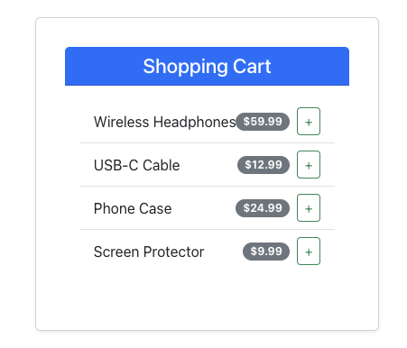
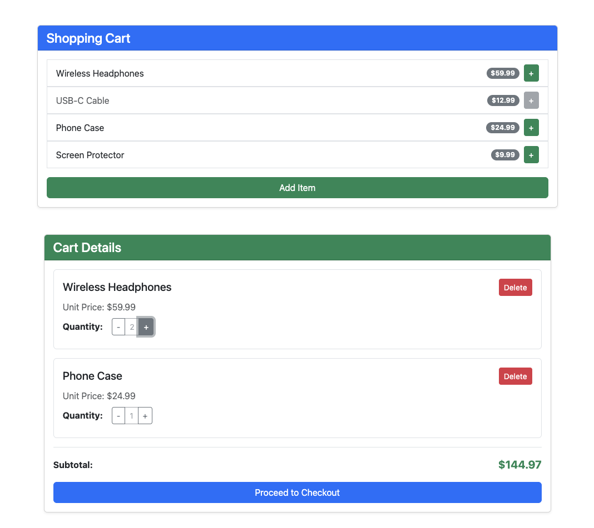

# React core fundamentals

Lets start with a small design. 



[Find the HTML structure and styles here](https://stackblitz.com/edit/vitejs-vite-8bcbkscg?file=src%2FApp.jsx)

To build this, lets scaffold a new Vite + React project.

```bash
npm create vite@latest react-core-fundamentals -- --template react

◇  Use rolldown-vite (Experimental)?:
│  No

◇  Install with npm and start now?
│  Yes


cd react-core-fundamentals
npm install
npm run dev

VITE v7.3.0  ready in 291 ms
  ➜  Local:   http://localhost:5173/

```
Get the app up and running , and see it in browser. 


## React Project Structure Explained

**node_modules**
Contains all the dependencies and libraries your project needs. Automatically generated when you run `npm install`. This folder can get massive, so it's excluded from version control.

**public**
Holds static assets that don't need processing—like images, fonts, or the favicon. Files here are served directly as-is without going through the build process.

**src**
Your main working directory where all your React components, styles, and application logic live. This is where you'll spend most of your development time.

**assets** (inside src)
Stores images, icons, and other media files that are imported into your components. Unlike the public folder, these assets get processed and optimized during the build.

**react.svg**
A sample SVG file, likely the React logo, used as an example asset or in the default starter template.

**App.css**
Stylesheet specifically for the App component. Contains styles that apply to your main App component's elements.

**App.jsx**
Your root component file. This is typically the top-level component that renders your entire application structure and child components.

**index.css**
Global stylesheet that applies to your entire application. Usually contains base styles, resets, and styles that should be available everywhere.

**main.jsx**
The entry point of your React application. This file renders your App component into the DOM and connects React to your HTML. It's where `ReactDOM.createRoot()` is called.

**.gitignore**
Specifies which files and folders Git should ignore when tracking changes. Typically includes node_modules, build files, and environment variables.

**eslint.config.js**
Configuration for ESLint, a tool that checks your code for errors and enforces coding standards. Helps maintain code quality and consistency.

**index.html**
The single HTML file for your entire application. Contains a root div where React injects your entire app. This is the "single page" in Single Page Application.

**package-lock.json**
Locks the exact versions of all dependencies and their sub-dependencies. Ensures everyone working on the project uses identical package versions.

**package.json**
Lists your project's dependencies, scripts, and metadata. Defines what packages to install and commands like `npm run dev` or `npm run build`.

**README.md**
Documentation file explaining what your project does, how to install it, and how to run it. Usually the first thing people read when viewing your repository.

**vite.config.js**
Configuration for Vite, your build tool. Defines how Vite should bundle your code, handle assets, run the dev server, and optimize for production.

## Vite's Development Flow 

When you run your app, **main.jsx** kicks things off by telling React to take your **App.jsx** component and inject it into the `<div id="root">` inside **index.html**. React then builds the Virtual DOM, compares it with the actual DOM, and renders only what's needed.


**Step 1: Vite Starts the Dev Server**
When you run `npm run dev`, Vite reads **vite.config.js** and starts a local development server

**Step 2: Browser Requests index.html**
You open the browser, and it requests **index.html**. Vite serves this file directly—it contains

```html
<body>
  <div id="root"></div>
  <script type="module" src="/src/main.jsx"></script>
</body>
```

**Step 3: Browser Requests main.jsx**

The browser sees the script tag and requests `main.jsx`. Vite intercepts this request, transforms the JSX to JavaScript using esbuild (super fast), and sends it back to the browser.

**Step 4: main.jsx Executes**
The browser runs **main.jsx**, which imports React, ReactDOM, and **App.jsx**. 

```jsx 
createRoot(document.getElementById('root')).render(
  <StrictMode>
    <App />
  </StrictMode>,
)
```

**Step 5: Browser Requests App.jsx**
Since **main.jsx** imports **App.jsx**, the browser requests it. Vite again transforms the JSX on-the-fly and sends it back.

**Step 6: React Renders**
React takes the `<App />` component, creates the Virtual DOM, and injects the actual HTML content into the `<div id="root">` in **index.html**. Your app appears on screen.

**The Magic:** Vite uses native ES modules, so imports happen in the browser with no bundling. Each file is transformed individually and cached. Changes trigger HMR to update only what changed—no full page reload needed.

The github repo for this project is [here](https://github.com/thecanadiandev/react-core-fundamentals).Check the individual commits for each steps. 

## Intro to Component and JSX

What we see here is a React component who returns some JSX.
JSX is a syntax extension for JavaScript that looks similar to HTML. It allows us to write HTML-like code within our JavaScript files, which React then transforms into actual DOM elements. 

**There are some differences between JSX and HTML, such as:**

- using `className` instead of `class`, 
- `htmlFor` instead of `for`, because `class` and `for` are reserved keywords in JavaScript.
- Also, component names must start with a capital letter.
- Self closing tags must end with a slash, like `` or `<input />`.
- Comments in JSX use curly braces and JavaScript syntax: `{/* This is a comment */}`.
- JSX expressions are wrapped in curly braces `{}` to embed JavaScript logic within the markup.
- Can only return a single parent element. To return multiple elements, wrap them in a `<div>`, `<section>`, or React Fragment (`<>...</>`).
- Cannot return multiple adjacent JSX elements without a parent wrapper.
- Cannot use statements (like `if` or `for`) directly inside JSX. Instead, use ternary operators or map functions.
- Under the hood, JSX gets transpiled to `React.createElement()` calls.

```js 
function App() {
  return (
    <>
      <h1> Welcome to JSX </h1>
    </>
  );
}

export default App;
```
Copy paste the same into babeljs home page and see how it transpiles to React.createElement calls.

## Basics 

Everything in React is a component. Components are reusable, self-contained pieces of UI that can accept inputs (called "props") and manage their own state. Lets see how that looks like.  If we have installed the Snippets extension, all we need to do is create a new file `Cart.jsx` and type `rafce` to get the boilerplate for a React Arrow Function Component. 

- We use curly braces `{}` inside JSX to embed JavaScript expressions.
- To loop over arrays and render lists, we use the `map()` function.
- Important: Each item in a list needs a unique `key` prop for React to track changes efficiently.
- We can dynamically bind class or attributes using expressions.
- We can use ternary or logical "AND" operators for conditional rendering.
- To add event handlers, use camelCase syntax like `onClick` and pass a function reference. Important: Don't call the function immediately (no parentheses). 
- If we need to pass arguments, use an arrow function.

Create a:

- titles property to show the cart title
- items array with some sample items (id, name, price, isAvailable)
- event handler "handleAddToCart" and console the item that is selected. 
- loop over the items and wire the button click event handler to the Add button. 

[Find the working solution in this commit](https://github.com/thecanadiandev/react-core-fundamentals/commit/f6afe4fc46ad904c513044301c521c1a40a694c7)

We usually do not stuff the entire component in a single file. We break things down into smaller components. Lets create a CartItem component for each item in the cart and pass the item data as props. This way, our code is more modular and easier to maintain. Parent component (Cart) passes data to child component (CartItem) via props.

From the previous example, refactor the Cart component to have this structure by adding a new file CartItem.jsx. Pass the data and event handler as props.

```
App (Cart)
 ├── CartItem  (for each item, receives item data as props)
```

[Find the working solution in this commit](https://github.com/thecanadiandev/react-core-fundamentals/commit/acef4515581a49ffc88066cdaa124a0e10bd4b8d)

## Styling Components

- Here, we used bootstrap. You can also use plain CSS, CSS Modules, Sass, Tailwind CSS, Styled Components, Emotion, or any other styling method you prefer.
- If we just import a CSS file in a component, its styles are global by default. To scope styles to a specific component, we can use CSS Modules or styled-components.
- There are dedicated component libraries like Material-UI, Ant Design, shadcn or Chakra UI that provide pre-built styled components we can use directly.
- Inline styling is also an option for dynamic styles, but it's less common for large projects.

for example 

```js 
<span style={{ cursor: item.isAvailable ? "pointer" : "not-allowed" }}></span>
```

## State 

Till this point, our components were stateless. They just received data via props and rendered it. But what if we want to add interactivity? Like updating the quantity of an item in the cart when the user clicks "+" or "-" buttons, or if clciking the Add Item button to add a new item into the cart. For that, we need state.

To add state to a functional component, we use the `useState` hook from React. When we call `useState`, it returns an array with two elements: the current state value and a function to update that state. We can use array destructuring to assign them to variables.

```js
// example: 
import { useState } from 'react';
const [count, setCount] = useState(0);
```

When we want to update the state, we call the setter function (`setCount` in this case) with the new value. React will then re-render the component with the updated state.
Even though the function is re-executed, React preserves the state between renders.

**There are 2 ways to update state:**

1. By passing the new value directly:
```js
setCount(5);
```
2. By passing a function that receives the previous state and returns the new state:
```js
setCount(prevCount => prevCount + 1);
```

**Few rules about state:**

- Always use the setter function to update state. Never modify the state variable directly.
- State updates are asynchronous and may be batched for performance. So, don't rely on the state value immediately after calling the setter.
- When updating state based on the previous state, always use the functional form to ensure you have the latest value.
- State can be of any type: primitives, objects, arrays, etc.
- Each call to `useState` creates a separate piece of state. You can have multiple state variables in a single component.
- Since "useState" is a hook, it can only be called at the top level of a functional component or from within other custom hooks. It cannot be called conditionally or inside loops.
- Cannot be used in class components.

## Component composition 

Composition is basically, "building complex UIs by combining simpler components". Instead of having one big component that does everything, we break it down into smaller, reusable pieces. Each piece (component) has a specific responsibility, making the code easier to manage and understand. When we feel like the component is getting too big or handling too many things, it's a good sign that we should break it down into smaller components.

Lets practice the composition and adding a state to manage the cart items. Refactor the Cart component to have this structure:


```
App 
 ├── Cart (state: items, title | events: addNewItem)
      ├── CartItem  (for each item, receives item data as props)
```

[Find the working solution in this commit](https://github.com/thecanadiandev/react-core-fundamentals/commit/d1acf530bb3be96bd87c2140604bf1e459212a11)

By this point, we should be comfortable with components, props, JSX, state and composition.

Now, lets add a bit more interactivity. We need to add a new component CartDetail to show the total items and total price. Based on user selection, it should update dynamically.

## Lifting State Up

Here is where, we start asking the question of **"Where should the state live?"**. The Cart component holds the list of items, but the CartDetail component needs to know about the total items and total price. Since both components need access to the same state, and both are siblings, we should lift the state up to their common parent, which is the App component.

```
App 
 ├── Cart 
      ├── CartItem  
      ├── CartDetail 
```

The HTML for CartDetail can be found in this [commit](https://github.com/thecanadiandev/react-core-fundamentals/commit/a95273d5834d1159eca287c7578a21ff1fd7a313)

And let's refactor the components again.

- Have App, Cart, CartItem, and CartDetail components.
- Lift state up to App and pass them down as props to Cart and CartDetail.
- Add callback functions to update state from child components.
- pass them as props.
- Finally, when user checkouts, we show an alert. 

[Find the working solution in this commit](https://github.com/thecanadiandev/react-core-fundamentals/commit/631d6b155d700d0de1342a58fd0a1aa1cc9fadc5)

## The prop drilling problem

If you notice, we are passing down props through multiple layers of components. For example,
All the event handlers are defined in App, then passed down to Cart, and then to CartItem. This is called **"prop drilling"** and can get messy as the component tree grows deeper.

Here, Cart is a middle layer that doesn't need to know about these handlers, but it has to pass them down anyway. This can make components less reusable and harder to maintain.
We will learn how to solve this problem using Context API in a future section.

By the end, you need to have the app looking something like this:



**Practicing component composition**

To the current solution, 

- Add a new CartModal component and make it dynamic enough to pass anything as content. 
- Show the same only when the user clicks on Proceed to Checkout button
- Hide and clear the cart when user clicks on Close button in the modal.

[Find the working solution in this commit](https://github.com/thecanadiandev/react-core-fundamentals/commit/5372f0ae2ff027bd4553d6acb293e413b415f86d)
