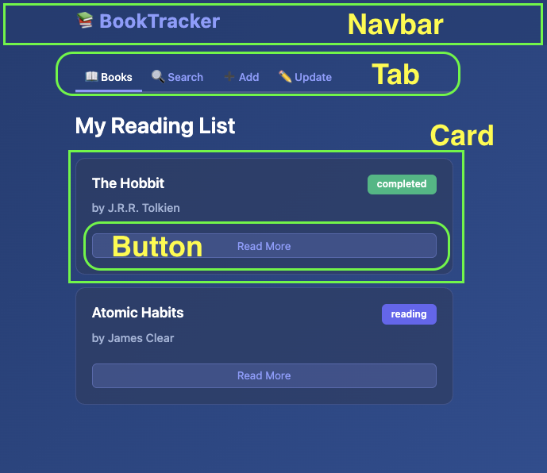
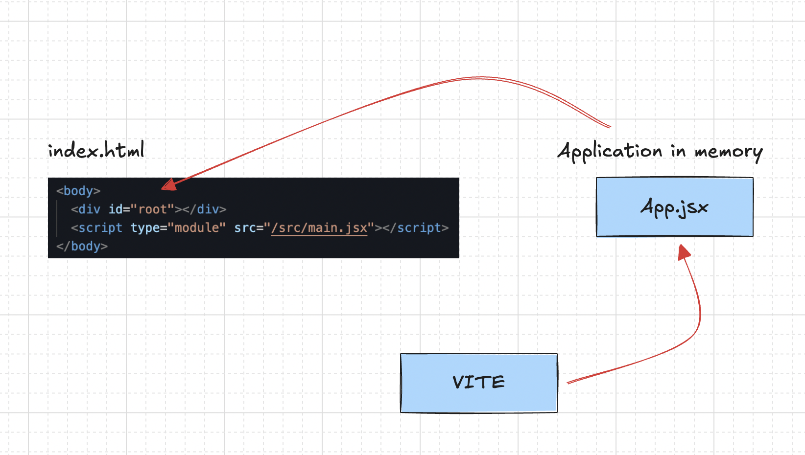

## What is React?

React is a JavaScript library for building user interfaces on web and native platforms.

**Key Characteristics:**

- **Seamless Navigation** - Applications feel like native mobile apps with smooth, instant transitions instead of traditional page reloads.
- **Dynamic UI Updates** - React uses JavaScript to manipulate the DOM and update the interface without full page refreshes. While vanilla JavaScript can achieve this, it's cumbersome and error-prone at scale.
- **Component-Based Architecture** - Shifts thinking from pages and page flows to reusable, self-contained components.
- **Declarative Programming** - The UI is a function of state. You describe what the interface should look like, and React handles the updates automatically.

This approach provides a simpler mental model and more efficient development workflow compared to traditional imperative DOM manipulation.

## Why React Over Vanilla JavaScript?

- **Development Speed** - Building complex UIs is significantly faster with React's component model versus manually writing DOM manipulation code.
- **Maintainability** - Components are self-contained and reusable. Changes are isolated and predictable, unlike sprawling vanilla JS where updates can have cascading side effects.
- **Declarative Approach** - You describe the desired UI state. React figures out how to update the DOM efficiently. With vanilla JS, you manually handle every DOM operation.
- **Performance** - React's virtual DOM optimizes updates by batching changes and minimizing actual DOM manipulations, which are expensive operations.
- **Ecosystem** - Access to a vast library of pre-built components, tools, and solutions. No need to reinvent common patterns.
- **Team Collaboration** - Standardized patterns make it easier for teams to work together and onboard new developers.

Vanilla JS is powerful but scales poorly for modern interactive applications. React provides structure where vanilla JS requires constant manual orchestration.

## Pre requisites

- Basic understanding of HTML, CSS, and JavaScript
- Familiarity with ES6+ features (e.g., arrow functions, classes, modules)
- Node js and npm installed on your machine
- A code editor like Visual Studio Code

## Architecture

Every contemporary frontend framework—React, Vue, Svelte, and others—revolves around UI components. Components are modular, independent building blocks of your interface, ranging from tiny elements like buttons to complete pages. They bundle together their structure, styling, and behavior, creating organized, maintainable code that's straightforward to understand.

In React, components are simply functions that output JSX (JavaScript XML)—a syntax allowing you to write HTML-like code directly in JavaScript. This fusion is incredibly powerful: you get familiar HTML tag syntax combined with dynamic JavaScript capabilities like expressions and conditional rendering. We'll dive deeper into JSX shortly.

**Separation of Concerns in React: A Different Perspective**

**Traditional separation** divided code by technology—HTML in one file, CSS in another, JavaScript in a third. This seemed logical: keep languages separate. However, this often meant a single feature (like a dropdown menu) had its markup, styling, and behavior scattered across three different files. Changing that feature required jumping between files, and reusing it meant copying code in multiple places.

**React's separation** divides code by feature or component—everything needed for one UI piece lives together. A button component contains its structure (JSX), appearance (styles), and behavior (event handlers) in one place. This is true separation of concerns because each component handles its own responsibility independently. You're not mixing technologies randomly; you're organizing by functionality.

The "concern" isn't the technology—it's the feature. When everything for one feature is colocated, your code becomes more modular, reusable, and easier to maintain. You can move, update, or delete an entire feature by working with a single component file.

Lets take a look at the react docs itself.

Below, we divide the design into components. Navbar, Banner, Button, and if needed can be further divided into smaller components.


## Scaffolding a React Application

To learn the basics, lets build something simple. Below is a simple design.



Here is the HTML and CSS for the same.

> [Stackblitz design example](https://stackblitz.com/edit/stackblitz-starters-cxpsgab6?file=index.html)

## Thinking in Components

- Try to divide the same into various components.
- Eg: Navbar, Tab, Card, Button etc
- There is no one right way to do this.
- Try to keep components small and focused on a single responsibility.
- Think about reusability, storing related logic together, separation of concerns etc
- Note: A Component name must start with a capital letter in React. That's how React differentiates between HTML tags and components.
- The JSX must return a renderable value with a single parent element. If there are multiple sibling elements, wrap them in a `<div>`, `<section>`, or React Fragment (`<>...</>`).
- Custom components must be self-closed if they have no children, e.g., `<Button />`.
- We can have `.js`, `.jsx`, `.ts`, or `.tsx` extensions for React components.
- We build a component, and when we feel loike it does more than one thing, we can break it down further into smaller components focused on a single responsibility.

## Installing react locally

Lets scaffold a new Vite + React project.

```bash
npm create vite@latest react-core-fundamentals -- --template react

◇  Use rolldown-vite (Experimental)?:
│  No

◇  Install with npm and start now?
│  Yes


cd react-core-fundamentals
npm install
npm run dev

VITE v7.3.0  ready in 291 ms
  ➜  Local:   http://localhost:5173/

```

Get the app up and running , and see it in browser.The design looks the same, but underneath, we divided them into components.

> [Stackblitz Solution here](https://stackblitz.com/edit/vitejs-vite-lajlypra?file=src%2FApp.jsx)

Here, we just created some simple static components & nested the components based on the hierarchy.
We learned how the component looks like, and what JSX is. We will talk about JSX in detail shortly.

## React Project Structure Explained

- **node_modules**
  Contains all the dependencies and libraries your project needs. Automatically generated when you run `npm install`. This folder can get massive, so it's excluded from version control.

- **public**
  Holds static assets that don't need processing—like images, fonts, or the favicon. Files here are served directly as-is without going through the build process.

- **src**
  Your main working directory where all your React components, styles, and application logic live. This is where you'll spend most of your development time.

- **assets** (inside src)
  Stores images, icons, and other media files that are imported into your components. Unlike the public folder, these assets get processed and optimized during the build.

- **react.svg**
  A sample SVG file, likely the React logo, used as an example asset or in the default starter template.

- **App.css**
  Stylesheet specifically for the App component. Contains styles that apply to your main App component's elements.

- **App.jsx**
  Your root component file. This is typically the top-level component that renders your entire application structure and child components.

- **index.css**
  Global stylesheet that applies to your entire application. Usually contains base styles, resets, and styles that should be available everywhere.

- **main.jsx**
  The entry point of your React application. This file renders your App component into the DOM and connects React to your HTML. It's where `ReactDOM.createRoot()` is called.

- **.gitignore**
  Specifies which files and folders Git should ignore when tracking changes. Typically includes node_modules, build files, and environment variables.

- **eslint.config.js**
  Configuration for ESLint, a tool that checks your code for errors and enforces coding standards. Helps maintain code quality and consistency.

- **index.html**
  The single HTML file for your entire application. Contains a root div where React injects your entire app. This is the "single page" in Single Page Application.

- **package-lock.json**
  Locks the exact versions of all dependencies and their sub-dependencies. Ensures everyone working on the project uses identical package versions.

- **package.json**
  Lists your project's dependencies, scripts, and metadata. Defines what packages to install and commands like `npm run dev` or `npm run build`.

- **README.md**
  Documentation file explaining what your project does, how to install it, and how to run it. Usually the first thing people read when viewing your repository.

- **vite.config.js**
  Configuration for Vite, your build tool. Defines how Vite should bundle your code, handle assets, run the dev server, and optimize for production.

## Vite's Development Flow

When you run your app, **main.jsx** kicks things off by telling React to take your **App.jsx** component and inject it into the `<div id="root">` inside **index.html**. React then builds the Virtual DOM, compares it with the actual DOM, and renders only what's needed.



**Step 1: Vite Starts the Dev Server**
When you run `npm run dev`, Vite reads **vite.config.js** and starts a local development server

**Step 2: Browser Requests index.html**
You open the browser, and it requests **index.html**. Vite serves this file directly—it contains

```html
<body>
  <div id="root"></div>
  <script type="module" src="/src/main.jsx"></script>
</body>
```

**Step 3: Browser Requests main.jsx**

The browser sees the script tag and requests `main.jsx`. Vite intercepts this request, transforms the JSX to JavaScript using esbuild (super fast), and sends it back to the browser.

**Step 4: main.jsx Executes**
The browser runs **main.jsx**, which imports React, ReactDOM, and **App.jsx**.

```jsx
createRoot(document.getElementById("root")).render(
  <StrictMode>
    <App />
  </StrictMode>,
);
```

**Step 5: Browser Requests App.jsx**
Since **main.jsx** imports **App.jsx**, the browser requests it. Vite again transforms the JSX on-the-fly and sends it back.

**Step 6: React Renders**
React takes the `<App />` component, creates the Virtual DOM, and injects the actual HTML content into the `<div id="root">` in **index.html**. Your app appears on screen.
During development mode, StrictMode helps identify potential problems by activating additional checks and warnings for its descendants. So app rerenders twice, but it happens only in dev mode.

## JSX

**What It Is** - A syntax extension that lets you write HTML-like code inside JavaScript. It makes React components more readable and intuitive.

**Key Differences from HTML:**

- Uses `className` instead of `class`
- Uses `htmlFor` instead of `for`
- Attribute names are camelCased (e.g., `onClick`, `tabIndex`)
- Self-closing tags require `/` (e.g., ``)
- Can embed JavaScript expressions with `{}`

**Behind the Scenes** - JSX is not valid JavaScript. Build tools (like Babel) transpile it into `React.createElement()` function calls before the browser sees it.

[Babeljs](https://babeljs.io/)

```jsx
// JSX you write
<div className="container">Hello</div>;

// Gets transpiled to
React.createElement("div", { className: "container" }, "Hello");
```

The browser never sees JSX—only the compiled JavaScript function calls that create React elements.

## Component Rendering Flow

If we just right click and see the page source, we will see just a div with id root. Which means when the app loads initially, there is no content in the div. React populates the content dynamically using JavaScript.

**Initial Render:** React starts at the root component and calls it as a function. This returns JSX (React elements).

**Tree Traversal:** When React encounters a component in the JSX, it calls that component function. This process continues recursively down the tree until it reaches native DOM elements
(like `div`, `span`).

**Building the Virtual DOM:** Each component call returns React elements that form a virtual representation of the UI tree —a lightweight JavaScript object structure.

**Committing to the DOM:** Once the complete virtual tree is built, React translates it into actual DOM operations and updates the browser's DOM in a single batch.

**Re-renders:** When state changes, React re-executes the affected component and its children, creates a new virtual tree, compares it with the previous one (diffing), and updates only what changed in the real DOM. This top-down, recursive process ensures predictable rendering and efficient updates.

```
App (root)
│
├─ calls App()
│  returns JSX with <header /> and <content />
│
├─► Header
│   │
│   ├─ calls Header()
│   │  returns <div><h1>Title</h1></div>
│   │
│   └─► DOM elements: div, h1
│
└─► Content
    │
    ├─ calls Content()
    │  returns <div><p>Text</p></div>
    │
    └─► DOM elements: div, p

Flow:
App → Header → div/h1 (DOM) → Content → div/p (DOM)
```

React builds virtual tree, then commits to actual DOM

## Making react dynamic

We use single curly braces `{}` to embed JavaScript expressions inside JSX. This allows us to insert dynamic values, call functions, and use any valid JavaScript code within our component's render output.

```jsx {2}
const name = "John";
return <h1>Hello, {name}!</h1>;
```

We cannot pass object directly, but arrays are allowed.

```jsx {1, 4}
const user = { firstName: "John", lastName: "Doe" };
return <h1>Hello, {user}!</h1>; // ❌ Error

const items = ["Apple", "Banana", "Cherry"];
return (
  <ul>
    {items.map((item) => (
      <li key={item}>{item}</li>
    ))}
  </ul>
);
```

## To include images

In React, to include images stored in the `src/assets` directory, you need to import them first and then use them in your JSX. This is because the build process needs to know about these assets to include them correctly.

```jsx {2,7}
import React from "react";
import logo from "./assets/logo.png"; // Import the image

function Header() {
  return (
    <header>
       {/* Use the imported image */}
      <h1>Welcome to My App</h1>
    </header>
  );
}
export default Header;
```

## Props

Props (short for "properties") are a way to pass data from a parent component to a child component in React. They allow you to customize and configure components by providing them with specific values.

```jsx {2,5}
function Greeting(props) {
  return <h1>Hello, {props.name}!</h1>;
}
function App() {
  return <Greeting name="Alice" />;
}
```

To pass multiple props, we can use the spread operator.

```jsx {2}
const user = { name: "Bob", age: 30 };
<Greeting {...user} />;
```

we can have default props.

```jsx {1}
function Greeting({ name = "Guest" }) {
  return <h1>Hello, {name}!</h1>;
}
```

## Children props

The `children` prop is a special prop in React that allows you to pass elements or components between the opening and closing tags of a component. This is useful for creating reusable components that can wrap other content. For eg: common layout components like cards, modals, or containers.

```jsx {2}
function Card(props) {
  return <div className="card">{props.children}</div>;
}
function App() {
  return (
    <Card>
      <h2>Card Title</h2>
      <p>This is some content inside the card.</p>
    </Card>
  );
}
```

There will be situations where we need multiple slots. In such cases, we can create custom props.

```jsx {4-6, 12}
function Layout(props) {
  return (
    <div className="layout">
      <header>{props.header}</header>
      <main>{props.children}</main>
      <footer>{props.footer}</footer>
    </div>
  );
}
function App() {
  return (
    <Layout header={<h1>My App</h1>} footer={<small>© 2026 My Company</small>}>
      <p>Welcome to my application!</p>
    </Layout>
  );
}
```

## File organizing

As your React application grows, organizing your files and folders becomes crucial for maintainability and scalability. Here are some common strategies for structuring a React project:

- **By Feature/Domain**: Group files by feature or domain. Each feature gets its own folder containing components, styles, and tests related to that feature.

  ```
  src/
  ├── features/
  │   ├── Cart/
  │   │   ├── Cart.jsx
  │   │   ├── Cart.css
  │   │   └── Cart.test.jsx
  │   └── UserProfile/
  │       ├── UserProfile.jsx
  │       ├── UserProfile.css
  │       └── UserProfile.test.jsx
  ```

- **By Type**: Separate files by type, such as components, styles, and utilities. This is simpler but can lead to large folders.

  ```
  src/
  ├── components/
  │   ├── Cart.jsx
  │   └── UserProfile.jsx
  ├── styles/
  │   ├── Cart.css
  │   └── UserProfile.css
  └── utils/
      └── api.js
  ```

- **Hybrid Approach**: Combine both strategies by grouping related components together while still separating styles and utilities.

  ```
  src/
  ├── components/
  │   ├── Cart/
  │   │   ├── Cart.jsx
  │   │   └── Cart.css
  │   └── UserProfile/
  │       ├── UserProfile.jsx
  │       └── UserProfile.css
  └── utils/
      └── api.js
  ```

## User interation with Events

In React, handling user interactions is done through event handlers. Events in React are similar to standard DOM events but are named using camelCase and passed as functions.

```jsx {2,5}
function Button() {
  function handleClick() {
    alert("Button clicked!");
  }
  return <button onClick={handleClick}>Click Me</button>;
}
```

Functions are first class citizens in JavaScript, so we can pass them around as arguments, return them from other functions, and assign them to variables. This makes it easy to define event handlers separately and pass them to components.

```jsx {2,6,9}
function Button({ onClick }) {
  return <button onClick={onClick}>Click Me</button>;
}

function App() {
  function handleClick() {
    alert("Button clicked!");
  }
  return <Button onClick={handleClick} />;
}
```

to pass arguments to event handlers, we can use arrow functions or bind (old way)

```jsx {8}
function Button({ onClick }) {
  return <button onClick={onClick}>Click Me</button>;
}
function App() {
  function handleClick(name) {
    alert(`Hello, ${name}!`);
  }
  return <Button onClick={() => handleClick("Alice")} />;
}
```

This covers a basic introduction to React components, JSX, props, and event handling. With these fundamentals, you can start building dynamic and interactive user interfaces using React!
