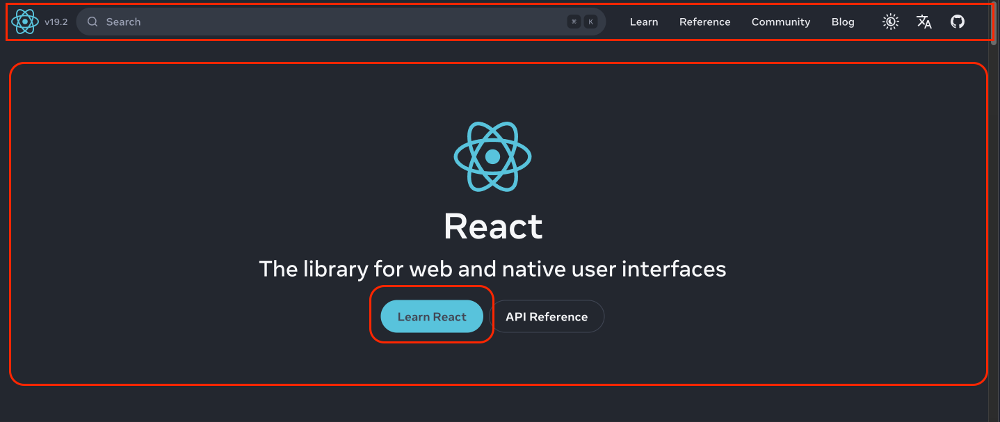

# React fundamentals

- Front end JS library to build UIs
- Created by Facebook in 2011, open sourced in 2013
- Component-based architecture
- At its core, React allows developers to build encapsulated components that manage their own state, and then compose them to create complex UIs.
- Essentially a library that provides the tools to build user interfaces, but it doesn’t dictate how you structure your application.
- Unlike frameworks like Angular or Vue, React focuses only on the UI, and you can choose additional tools for things like routing (React Router) and state management (Zustand, Redux, or Context API).
- Next.js is a framework built on React that provides additional features like server-side rendering, file-based routing, and API handling.

## Why use React

 Here are the compelling reasons to consider react over plain JavaScript for building web applications:

**1. Create Dynamic, Engaging Interfaces**

Modern web users expect interactive experiences—not static pages with text and images. They want responsive forms, clickable elements, and real-time updates. React simplifies building these experiences through built-in features like state management and hooks. While vanilla JavaScript works fine for fundamentals and smaller projects, complex applications quickly become unwieldy without a framework like React.

**2. Modular Component Structure**

React's component-based approach lets you build reusable UI pieces—buttons, forms, navigation menus—instead of writing monolithic code. Need to update a button's styling? Change it once, and it updates everywhere. This modularity keeps your codebase organized, maintainable, and scalable as your application grows.

**3. Intuitive and Readable Code**

React's declarative syntax means you describe your desired UI outcome, and React handles the implementation details. This approach is cleaner and more debuggable than manually manipulating the DOM with vanilla JavaScript.

**4. Thriving Ecosystem**

React's widespread adoption means access to extensive community support, countless third-party libraries, and abundant learning resources. Need routing? State management? UI components? There's likely a battle-tested React solution available.

**5. Industry Standard**

For aspiring web developers, React offers the strongest job prospects—it's the dominant frontend technology in professional development.

**6. Versatile Skill Application**

React knowledge transfers across platforms and meta-frameworks, enabling you to build diverse application types with a single learned skill set.

## Understanding React Rendering Strategies

### **Single Page Application (SPA)**

SPAs load one HTML page initially, then use JavaScript to dynamically update content without full page reloads. React handles all rendering in the browser—when you navigate, it manipulates the DOM rather than fetching new pages from the server. This creates smooth, app-like experiences with fast navigation after the initial load. However, SPAs suffer from slower first loads (JavaScript must download first), poor SEO, and blank screens until React executes. They're ideal for dashboards, admin panels, and internal tools where SEO isn't a priority.

### **Server-Side Rendering (SSR)**

SSR generates complete HTML on the server for each request before sending it to the browser. When users request a page, the server runs React, creates the HTML, and delivers a fully-rendered page that's immediately visible. Once the page loads, React "hydrates" it to add interactivity. This approach offers excellent SEO since search engines receive complete HTML, and users see content faster. The tradeoff is increased server load and complexity. SSR works best for e-commerce sites, content platforms, and any application requiring strong SEO with dynamic content.

### **Static Site Generation (SSG)**

SSG pre-builds all pages as static HTML files during deployment rather than at request time. React generates the complete HTML for every page during the build process, and these files are served instantly from a CDN. This delivers the fastest possible load times, perfect SEO, and minimal server costs. However, any content change requires rebuilding and redeploying the entire site, making it unsuitable for frequently updated or personalized content. SSG excels for blogs, documentation, portfolios, and marketing sites with relatively static content.

### **Other options** 

- **React Native** for building mobile applications using React principles.
- **Electron** for creating cross-platform desktop applications with web technologies.

## Know the architecture 

Every contemporary frontend framework—React, Vue, Svelte, and others—revolves around UI components. Components are modular, independent building blocks of your interface, ranging from tiny elements like buttons to complete pages. They bundle together their structure, styling, and behavior, creating organized, maintainable code that's straightforward to understand.

In React, components are simply functions that output JSX (JavaScript XML)—a syntax allowing you to write HTML-like code directly in JavaScript. This fusion is incredibly powerful: you get familiar HTML tag syntax combined with dynamic JavaScript capabilities like expressions and conditional rendering. We'll dive deeper into JSX shortly.

Components can hold internal data called state—think of a true/false value tracking whether a dropdown menu is visible, or an array storing blog posts fetched from an API. Beyond individual component state, React also supports application-wide state management, which we'll explore later in the course.

**Separation of Concerns in React: A Different Perspective**

**Traditional separation** divided code by technology—HTML in one file, CSS in another, JavaScript in a third. This seemed logical: keep languages separate. However, this often meant a single feature (like a dropdown menu) had its markup, styling, and behavior scattered across three different files. Changing that feature required jumping between files, and reusing it meant copying code in multiple places.

**React's separation** divides code by feature or component—everything needed for one UI piece lives together. A button component contains its structure (JSX), appearance (styles), and behavior (event handlers) in one place. This is true separation of concerns because each component handles its own responsibility independently. You're not mixing technologies randomly; you're organizing by functionality. 

The "concern" isn't the technology—it's the feature. When everything for one feature is colocated, your code becomes more modular, reusable, and easier to maintain. You can move, update, or delete an entire feature by working with a single component file.

Below, we divide the design into components. Navbar, Banner, Button, and if needed can be further divided into smaller components.



**Simplest Example of a React Component**

What we write here is JSX, not HTML. JSX allows us to embed dynamic JavaScript expressions within curly braces.

```jsx
import React from 'react';

// a component
function Welcome({ name }) {
  return <h1>Welcome, {name}!</h1>;
} 
export default Welcome;

// using the component within another component
import Welcome from './Welcome';

function App() {
  return (
    <div>
      <Welcome name="React" />
    </div>
  );
}
```

## Advantages of React Over Vanilla JavaScript

- **Modular Component Structure** - Build reusable UI pieces instead of monolithic code
- **Intuitive Declarative syntax** - Describe what you want, React handles how it happens
- **Built-in State Handling** - Manage data and UI updates seamlessly. View is a function of state. So when state changes, view updates automatically.
- **Smart Rendering System** - React efficiently updates only what's changed
- **Rich Ecosystem & Tools** - Access extensive libraries, resources, and community support (React Router, Zustand, Redux, etc.)

## React's Tooling Landscape

- **Core Libraries** - React and ReactDOM for building interfaces
- **Build Tools** - Vite for fast development and optimized builds
- **Navigation** - React Router for client-side routing
- **Data Fetching** - TanStack Query for server state management
- **Meta-Frameworks** - Next.js for full-stack React applications
- **Static Generators** - Gatsby and Astro for pre-rendered sites
- **Mobile Development** - React Native for iOS and Android apps
- **State Solutions** - Redux, Zustand, and Recoil for complex state management
- **Developer Experience** - Extensions and plugins for enhanced productivity

## Behind the scenes

**DOM (Document Object Model)**
The browser's representation of your webpage as a tree structure of elements. It's what you see and interact with—every HTML tag becomes a node in this tree. Manipulating it directly is slow because browsers have to recalculate styles, layouts, and repaint the screen.

**Virtual DOM**
React's lightweight JavaScript copy of the actual DOM. It's a simple object representation that React keeps in memory. Since it's just JavaScript objects, working with it is extremely fast—no browser rendering involved.

**Diffing**
The process where React compares the new Virtual DOM with the previous version to identify what changed. Instead of checking every single element, React uses smart algorithms to quickly spot differences—like "this button's text changed" or "this list item was added."

**Reconciliation**
After diffing identifies the changes, reconciliation is React's process of efficiently updating the real DOM with only those specific changes. Rather than rebuilding the entire page, React surgically updates just the parts that changed—making updates fast and efficient.

**In Simple Terms:** You update state → React creates a new Virtual DOM → Diffing finds what changed → Reconciliation algorithm updates only those specific parts in the real DOM. This is why React feels fast despite JavaScript being involved in every update.

## JSX to JavaScript conversion 

[Babel transpilation example](https://babeljs.io/)

## React 19 Compiler

React 19 introduced an optimizing compiler that fundamentally changed how React operates internally. This compiler automatically transforms your code into a more efficient version. Before React 19, developers had to manually implement optimizations like memoization—a technique that caches results of expensive computations to avoid redundant recalculations. The new compiler handles these optimizations automatically, improving performance without requiring extra effort from developers. That covers the essential mechanics of how React functions internally. 

- The Virtual DOM serves as an efficient intermediary for managing updates, 
- while the diffing and reconciliation processes—powered by the Fiber architecture—determine exactly what needs to change. 
- Behind the scenes, React.createElement constructs the component tree structure. 
- JSX provides a developer-friendly syntax for writing components
- and now React 19's compiler adds automatic performance optimizations that previously required manual implementation.

## Setup Development Environment

- Install Node.js and npm
- Use a code editor like VS Code
- Set up a React project using Vite or Create React App
- VS Code extensions for React development (ES7+ React snippets, Prettier, ESLint)
- Browser DevTools for debugging React applications (React Developer Tools)
- Git 