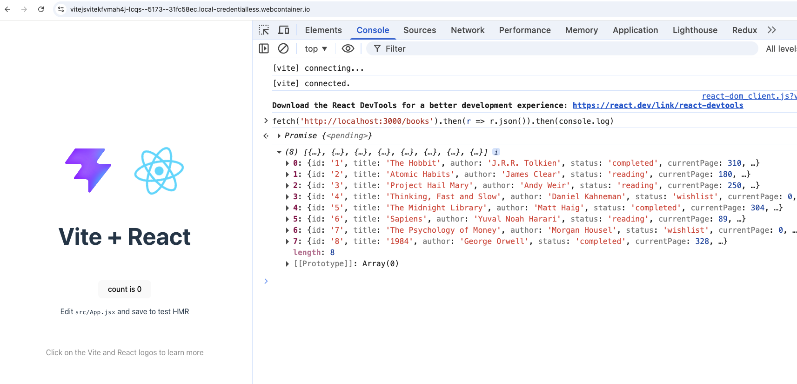

# Why Use TanStack Query (React Query)?

Note: This is a bonus lecture.

## The Problem with Traditional Approaches

**useEffect + fetch** requires you to manually manage loading states, error states, and data for every single request. You end up writing the same boilerplate code repeatedly across your application. There's no built-in caching, so the same data gets fetched multiple times unnecessarily. Background refetching doesn't exist, and handling edge cases like race conditions, request cancellation, and retry logic requires custom solutions you must build and maintain yourself.

### What TanStack Query Solves

**Automatic Caching** - Data is cached immediately and reused across your app. When you navigate back to a page, the cached data shows instantly while fresh data loads in the background. This "stale-while-revalidate" pattern makes your app feel incredibly fast.

**Smart Background Updates** - Queries automatically refetch when data becomes stale, when the window regains focus, or when the network reconnects. Your UI stays synchronized with your backend without manual intervention.

**Eliminates Boilerplate** - No need to manually track loading, error, and data states for each request. TanStack Query handles all of this internally with a simple, declarative API.

**Request Deduplication** - Multiple components requesting the same data triggers only one network request. The result is shared across all components automatically.

**Built-in Performance Features** - Automatic request cancellation prevents race conditions. Pagination and infinite scrolling are handled with dedicated hooks. Optimistic updates let you show changes instantly before server confirmation, with automatic rollback on failure.

**Developer Experience** - The included DevTools let you visualize all queries, inspect cached data, and manually trigger refetches. Debugging becomes straightforward instead of hunting through console logs.

## Compared to Alternatives

**Redux/Context API** - These are state management tools, not data-fetching solutions. You still need to write all the fetching logic, caching, and synchronization yourself. TanStack Query is purpose-built for server state and does the heavy lifting for you.

**SWR** - Similar concept but TanStack Query offers more features: better TypeScript support, more granular cache control, mutations with optimistic updates, and a more mature ecosystem.

**Apollo Client** - Excellent for GraphQL but overkill for REST APIs. TanStack Query is agnostic to your backend - REST, GraphQL, or anything else - and much lighter weight.

## The Bottom Line

TanStack Query transforms server state management from a chore into a solved problem. You write less code, get better performance, and deliver a snappier user experience. It's become the industry standard because it handles the complexity of data fetching so you can focus on building features instead of managing state.

## Main topics covered in this section

- Setup & Installation
- Step 1: Basic Query - Display All Books
- Step 2: Understanding Caching
- Step 3: Loading & Error States
- Step 4: Dynamic Query - Search Books
- Step 5: Abort Requests
- Step 6: Conditional Queries
- Step 7: Create Mutation - Add New Book
- Step 8: Update Mutation - Mark as Completed
- Step 9: Optimistic Updates with Rollback
- Step 10: React Router Integration
- Step 11: Global Loading Indicator

## Setting up the backend

- Attached is a simple node express server setup that server some books data.
- To run the server, open up a new terminal and do `node server.js` from the root.
- Check the terminal to see the server up and running.
- Open the preview in new tab. and navigate to whatever domain + "/books" to see the data being served from the backend.
- You should see the JSON data of 5 books being displayed in the browser.
- In total we should have 2 terminals, one for `node server.js` and other for `npm run dev` side by side.
- One will open up in `localhost:3000` and other in `localhost:5173`
- Click on the second one to see the react app running.
- Open dev tools and type

```bash
fetch('http://localhost:3000/books').then(r => r.json()).then(console.log)
```

You should see the same books data being logged in the console.



If you do this setup locally, the approach remains the same.

> [Stackblitz setup for backend](https://stackblitz.com/edit/vitejs-vite-kfvmah4j)

## Install TanStack Query & other packages

In command line,

```bash
npm i @tanstack/react-query @tanstack/react-query-devtools bootstrap react-router-dom
```

In main.jsx, setup the QueryClientProvider at the root of the app.

```js
import "bootstrap/dist/css/bootstrap.min.css";

import { QueryClient, QueryClientProvider } from "@tanstack/react-query";
import { ReactQueryDevtools } from "@tanstack/react-query-devtools";

const queryClient = new QueryClient();

createRoot(document.getElementById("root")).render(
  <StrictMode>
    <QueryClientProvider client={queryClient}>
      <App />
      <ReactQueryDevtools initialIsOpen={false} />
    </QueryClientProvider>
  </StrictMode>,
);
```

- add the respective styles in index.css if you are doing this locally.
- App.jsx contains basic routing setup using react-router-dom.
- `utils/http.js` contains the functions that fetches the data from the backend.

## Basic query: Fetch all books

In BookList component, we use the `useQuery` hook to fetch and display the list of books.

- useQuery takes a queryKey (unique identifier) and queryFn (function that fetches data)
- The data contains our books array
- No manual state management needed.
- staleTime of 0 means data is considered stale immediately after fetching.

```js
const { data, isPending, isError, error } = useQuery({
  queryKey: ["books"],
  queryFn: getAllBooks,
  staleTime: 30000,
});
```

The full implementation of BookList component can be found here:

> [Stackblitz example](https://stackblitz.com/edit/vitejs-vite-rnecjbz5?file=src%2FApp.jsx)

## Understanding Caching

- TanStack Query caches data based on the queryKey.
- If you navigate away and return within the staleTime, cached data is used instantly.
- After staleTime, it refetches in the background to update the cache.
- Open React Query DevTools to visualize cached queries and their states.
- In dev tools , we see initially that the books query is fresh for 30 seconds, after which it becomes stale and refetches when we revisit the component. Check the network tab to see the refetch in action.
- Change the staleTime to see how it affects caching behavior.
- `cacheTime` controls how long unused data remains in cache before garbage collection. Default is 5 minutes.

### Stale vs cache

**staleTime** controls when data needs refreshing. Set it based on how often your data changes:

- **0 (default)** - Data changes frequently (stock prices, live scores, social feeds). Refetch on every mount.
- **5-10 seconds** - Real-time-ish data (notifications, chat messages, active dashboards)
- **30 seconds to 2 minutes** - Moderately dynamic data (user profiles, product listings, search results)
- **5-10 minutes** - Relatively stable data (settings, categories, static content)
- **Infinity** - Data never changes (app configuration, feature flags, constants)

**gcTime (formerly cacheTime)** controls how long unused data stays in memory. Set it based on navigation patterns:

- **5 minutes (default)** - Good for most apps. Keeps data while user navigates around.
- **10-30 minutes** - For apps with lots of back-and-forth navigation (dashboards, admin panels)
- **1-2 minutes** - Memory-constrained apps or lots of unique queries
- **Infinity** - Data you want to keep the entire session (user info, app state)

**Key principle:** `staleTime` should always be less than or equal to `gcTime`. You can't use stale data if it's been garbage collected.

## Loading and error states

- `useQuery` provides `isPending`, `isError`, and `error` states out of the box.
- No need to manually manage loading and error states.
- Open the tanstack dev tools and see how the states change during fetching.
- Play with the network throttling to see loading states in action.
- Change the staleTime to see how it affects refetching behavior.

> [Stackblitz example](https://stackblitz.com/edit/vitejs-vite-tvh6bxny?file=src%2FApp.jsx)

## Dynamic query : Search Books & Aborting requests

- We can create dynamic queries by using variables in the queryKey and queryFn.
- Here, we add a search input to filter books by title.

```js
const { data, isPending, isLoading, isError, error } = useQuery({
  queryKey: ["books", { search }],
  queryFn: ({ signal }) => searchBooks({ signal, searchTerm: search }),
  enabled: search.length >= 2,
  staleTime: 30000,
});
```

Here, the queryKey includes the search term, so a new query is created for each unique search. The queryFn uses the search term to fetch filtered results. We also use the `enabled` option to only run the query when the search term has at least 2 characters. The signal parameter allows us to abort the request if needed. Inspect the network tab to see how new requests are made for different search terms and how the older requests are aborted.

Also, see how caching works. Search for "the" and it shows 3 results. Now go back to Books, come back and search for same "the". See how it uses the cached data instantly without making a network request. Play with cache and stale times to see how it affects this behavior.

Note: If the UX is jittery, we can add

```
placeholderData: (previousData) => previousData
```

This will show the previous data while new data is being fetched for better UX.

> [Stackblitz example](https://stackblitz.com/edit/vitejs-vite-p1j6yfdl?file=src%2Fcomponents%2FSearchBooks.jsx)

## Conditional Queries

- Sometimes, we want to fetch data only under certain conditions.
- We can use the `enabled` option to conditionally run a query.

### Understanding isPending vs isLoading:

When a query is disabled, there are two different states to consider:

```js
const { data, isPending, isLoading, isError, error } = useQuery({
  queryKey: ["books", { search }],
  queryFn: ({ signal }) => searchBooks({ signal, searchTerm: search }),
  enabled: search.length >= 2,
});

console.log("isPending:", isPending, "isLoading:", isLoading);
```

- isPending = true when query has no data (includes disabled queries)
- isLoading = true when query is actively fetching for the first time

For conditional queries, use `isLoading` if you only want to show loading when actually fetching. Use `isLoading` for conditional queries to avoid showing "loading" when disabled.

## Create Mutation - Add New Book

`useQuery` is for fetching data (GET requests). For creating, updating, or deleting data (POST, PUT, DELETE requests), we use `useMutation`.

We need access to the QueryClient to invalidate queries after a mutation so that the UI stays in sync with the server. Basically, when we add a new book, we want to refetch the books list to include the newly added book. So we need to invalidate the "books" query after a successful mutation. The onSuccess callback is where we perform this invalidation.

When we call "mutate" with the new book data, it triggers the createBook function to send a POST request to the server. We dont need to pass the parameters to useMutation itself. The parameters are passed when we call mutate. If we want, we can add things like currentPage, totalPages etc to make it more dynamic. In our example, we are just passing title and author.

Open the network tab to see the POST request being made when we add a new book. After the request succeeds, the books query is invalidated, triggering a refetch to get the updated list including the new book.

```js
import { useMutation, useQueryClient } from "@tanstack/react-query";
import { createBook } from "../utils/http";
import { useNavigate } from "react-router-dom";

export default function AddBook() {
  const queryClient = useQueryClient();

  const { mutate, isPending, isError, error } = useMutation({
    mutationFn: createBook,
    onSuccess: () => {
      queryClient.invalidateQueries({ queryKey: ["books"] });
      setTitle("");
      setAuthor("");
      navigate("/");
    },
  });

  function handleSubmit(e) {
    e.preventDefault();

    mutate({
      title,
      author,
      status: "wishlist",
      currentPage: 0,
      totalPages: 0,
      genre: "Unknown",
    });
  }
}
```

> [Stackblitz example](https://stackblitz.com/edit/vitejs-vite-qvhh1enc?file=src%2Fcomponents%2FAddBook.jsx)

## Update Mutation - Mark as Completed

Similar to creating a new book, we can use `useMutation` to update existing data. Here, we add a button to mark a book as completed. When clicked, it triggers a mutation to update the book's status on the server. After the mutation succeeds, we invalidate the "books" query to refetch the updated list.

```js
const { mutate, isPending, isError, error } = useMutation({
  mutationFn: updateBook,
  onSuccess: () => {
    queryClient.invalidateQueries({ queryKey: ["books"] });
    setBookId("");
    setCurrentPage("");
  },
});

function handleSubmit(e, action) {
  e.preventDefault();

  const updates =
    action === "complete"
      ? { status: "completed", currentPage: currentPage || 0 }
      : { currentPage: parseInt(currentPage) };

  mutate({
    id: bookId,
    updates,
  });
}
```

Here, when we call `mutate` with the book ID and updates, it sends a PUT request to update the book on the server. After success, we invalidate the "books" query to refresh the list.

> [Stackblitz example](https://stackblitz.com/edit/vitejs-vite-2k1cog9q?file=src%2Fcomponents%2FUpdateBook.jsx)

We can also notice that if we quickly submit and come back to the books route, we might see stale data for a brief moment before the refetch completes. This is because the books query is marked as stale immediately after invalidation, so it shows cached data while fetching fresh data in the background. We can do optimistic updates to improve this UX.

## Optimistic Updates with Rollback

Optimistic updates let us update the UI immediately before the server confirms the change. If the server request fails, we can rollback to the previous state.

```js
const { mutate, isPending, isError, error } = useMutation({
  mutationFn: updateBook,
  onMutate: async (variables) => {
    // Cancel outgoing refetches
    await queryClient.cancelQueries({ queryKey: ["books"] });

    // Snapshot previous value
    const previousBooks = queryClient.getQueryData(["books"]);

    // Optimistically update cache
    if (previousBooks) {
      queryClient.setQueryData(["books"], (old) =>
        old.map((book) =>
          book.id === variables.id ? { ...book, ...variables.updates } : book,
        ),
      );
    }

    // Return context with previous data
    return { previousBooks };
  },
  onError: (err, variables, context) => {
    // Rollback on error
    if (context?.previousBooks) {
      queryClient.setQueryData(["books"], context.previousBooks);
    }
  },
  onSettled: () => {
    // Refetch to ensure we have correct data
    queryClient.invalidateQueries({ queryKey: ["books"] });
  },
});
```

We use the onMutate callback to optimistically update the cache before the mutation runs. We snapshot the previous books data so we can rollback if needed. If the mutation fails, onError restores the previous data. Finally, onSettled refetches to ensure we have the latest data from the server.

> [Stackblitz example](https://stackblitz.com/edit/vitejs-vite-l326yp4s?file=src%2Fcomponents%2FUpdateBook.jsx)

It might be too fast to notice the optimistic update in action. To simulate a slower network, open dev tools and set throttling to "Slow 3G". Now when you mark a book as completed, you'll see the UI update instantly while the network request is in progress. If you simulate a failure (e.g., by stopping the backend server), you'll see the UI rollback to the previous state.

## React Router Integration

- When using React Router, we can access route params in our query functions.

> [Stackblitz example](https://stackblitz.com/edit/vitejs-vite-uywbtnmm?file=src%2Fcomponents%2FBookDetails.jsx)

## Global Loading Indicator

If we like, we can add global loading indicators

```js
import { BrowserRouter, Routes, Route, Link } from "react-router-dom";
import { useIsFetching } from "@tanstack/react-query";

function App() {
  const isFetching = useIsFetching();

  return (
    <BrowserRouter>
      <nav className="navbar navbar-light bg-light">
        <div className="container">
          ...
          {isFetching > 0 && (
            <div className="ms-auto d-flex align-items-center">
              <div
                className="spinner-border spinner-border-sm text-primary me-2"
                role="status"
              >
                <span className="visually-hidden">Loading...</span>
              </div>
              <small className="text-muted">Fetching data...</small>
            </div>
          )}
        </div>
      </nav>

      <Routes>...</Routes>
    </BrowserRouter>
  );
}

export default App;
```

This may be useful in apps with multiple data-fetching components to give users feedback when any background requests are in progress.

TanStack query contains a lot more features like pagination, infinite scrolling, query cancellation, dependent queries, query prefetching etc. Explore the official docs for more advanced use cases.

## Dark theme version of the app

> [Stackblitz example](https://stackblitz.com/edit/vitejs-vite-x1b6mqkv?file=src%2Findex.css)
