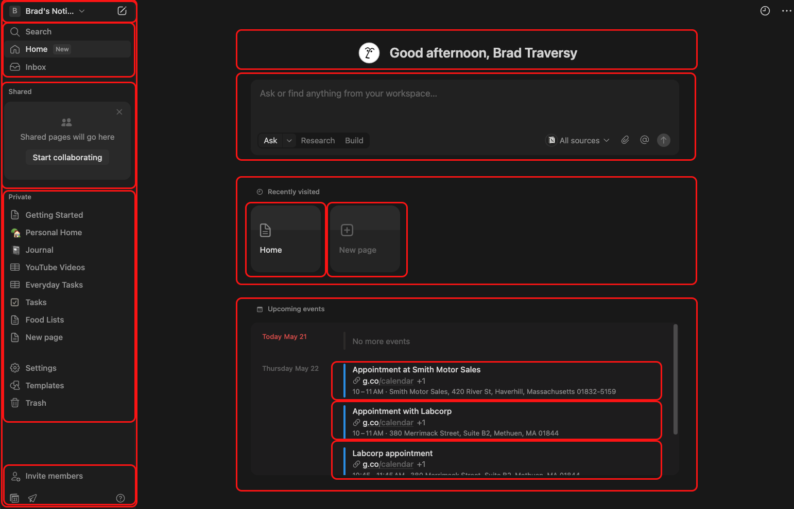
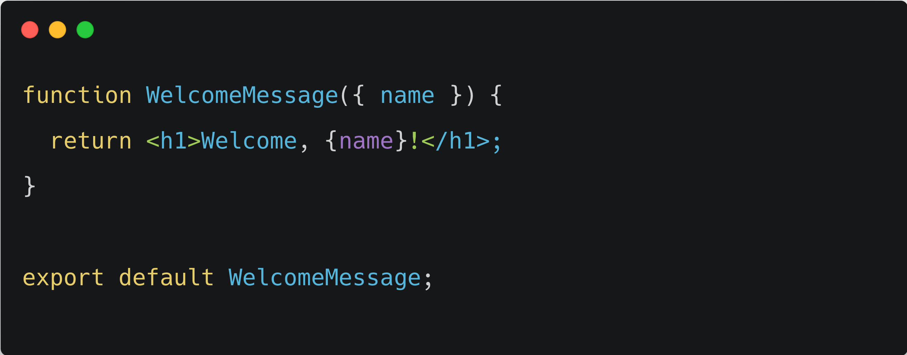
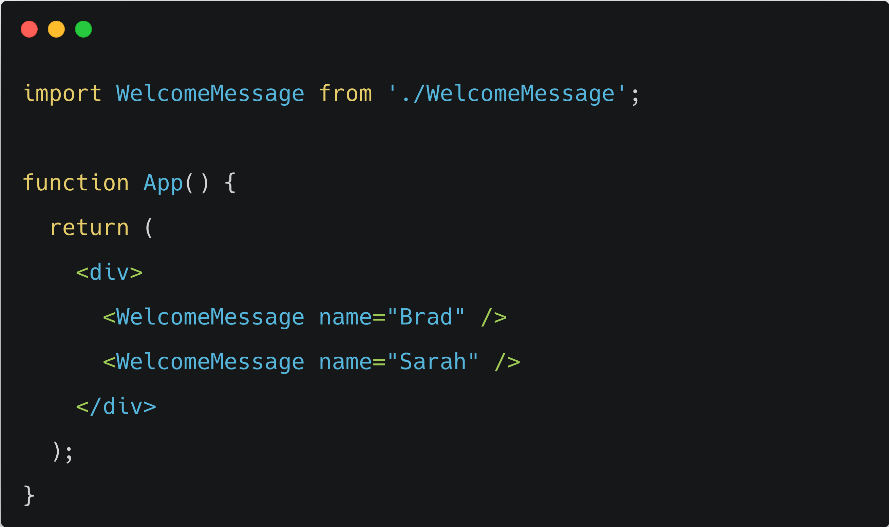

# Component Based Development

When you start to get into the world of front-end web development, you're getting into the world of components. All modern frontend frameworks — whether it's React, Vue, Svelte, or anything else — are built around the concept of UI components.

A component is a reusable, self-contained piece of the user interface. It can be as small as a button or as large as an entire page. Components encapsulate their own structure (HTML/JSX), styling (CSS or class names), and logic (JavaScript), making your code modular and easier to reason about.

A React component in your code is just a function that returns something called JSX or JavaScript XML, which is a syntax extension that essentially allows you to write HTML within your JavaScript. This is powerful because your can use HTML tag syntax but it's dynamic and you can have JavaScript expressions and conditional output. We'll be getting into JSX very soon.

Components can also have data associated with them called state. This could be something as simple as a boolean to show if a modal or menu is open or closed or it could be an array of data such as blog posts pulled from an api. There's also a concept of global or app state as well, which we'll get into later.

Now if you've been a web developer for a while but just never got into front-end frameworks, it can throw some people off because when you learn HTML, CSS, and JavaScript, you tend to think of them as separate layers. You write your HTML in one file, your CSS in another, and your JavaScript in another. But in component-based development — especially with React — those technologies are combined together into a single component.

So instead of splitting by technology, you split by components and functionality. Each component contains everything it needs to render and behave correctly: the markup (JSX), the styles (via classes or scoped styling), and the behavior (logic, state, and events). This makes it easier to reuse, test, and maintain your code.

So if you look at an interface like this notion one, it's really just a bunch of components working together. Some components may be very simple with no state and some can be really complicated. This header might be a simple component — just displaying a welcome message with no state or logic. Then you may have this search or ask component with different options and filters. You can attach files and so on. So this component would be much more intricate.

Components can also be nested inside one another. For instance, the box on the bottom right may be called "Upcoming Events" and in that you have each event, which would be child components of the upcoming events. You would likely pass the event data into each event component using something called "props", which are like HTML attributes.

The idea is that you can compose an entire application by putting these small, focused components together — like building blocks. If one component breaks, it doesn't crash your entire app. If you want to reuse an "Event" component anywhere in your project, you can do that.

This approach makes your app easier to scale, easier to test, and easier to maintain over time. Instead of working with one massive HTML file and a bunch of scattered scripts, you're working with small, clearly defined units that each do one thing well.

## Simple Example

Here is about the simplest example that you can get for a React component. It's a component called 
`WelcomeMessage` and it outputs an `h1` element with the word welcome and then a dynamic name. Remember, React components are functions. This `h1` element renders in the browser as HTML, but what we're typing here is JSX. That's why we can have this dynamic `name` variable. Obviously you couldn't do this with straight HTML. Now this `name` value is being passed in as a prop. `props` is an object and we're destructuring the name prop. That's why we're using curly braces.

Now let's look at how we would use this component. We embed it like an HTML tag. So it's like a custom `WelcomeMessage` HTML tag and we are passing a name prop in like we would an attribute and that's what is being output within the `h1` tag. Components are reusable and in this case, we are using it twice with two different names. Brad and Sarah.

That's a very basic example of a React component. We could also have our CSS within the component. So it would encapsulate structure, style and logic or behavior.

If you've been a web developer for years building more monolithic applications, you may need some time to get used to this because we were taught years ago about separation of concerns. All that's gone out the window with this newer approach of grouping UI and functionality over technologies. I promise you though if you want to build interactive interfaces and not just static tables of data, this is the way to go.