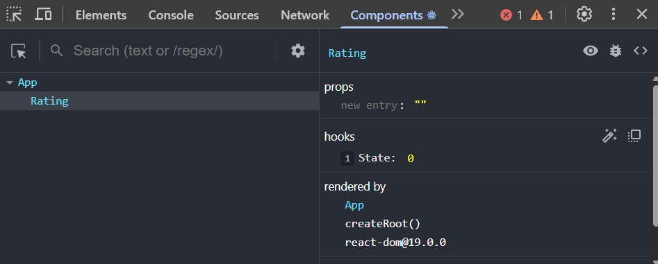

# Add Rating To State

Let's add a rating value to state using the `useState` hook.

Add the following to the `Rating.jsx` file:

```jsx
import { useState } from 'react';
```

As far as what I want to include for state in our rating component, I want to have the rating itself. So if the user selects a rating of 3 stars, I want to store that value in state. The other piece of state will be if the star is going to be called 'hover' and will represent how many stars should be filled in when the user hovers over the stars. If they hover over the 3rd star, I want to fill in the first 3 stars.

Let's start with the rating. Within the function, add the following right above the return statement:

```jsx
const [rating, setRating] = useState(0);
```

This is how you define all of your component state. You call the `useState` function and pass in the initial value of the state. In this case, I'm passing in `0` because I want the initial rating to be 0. The `useState` function returns an array with two values. The first value is the current value of the state, and the second value is a function that allows you to update the state. I'm destructuring the array and naming the first value `rating` and the second value `setRating`. The convention is to name the second value `set` followed by the name of the state.

### Updating State

To update the state, you call the function that was returned from the `useState` function and pass in the new value. State is immutable, so you can't directly change the value of the state. Fo instance, you would never do something like this:

```jsx
rating = 3;
```

Instead, you would call the `setRating` function and pass in the new value. I want to set the rating when a star is clicked on. So let's add an `onClick` event to the stars.

```jsx
<span key={star} className='star' onClick={() => setRating(star)}>
  {'\u2605'}
</span>
```

We added an `onClick` event to the star span. When the star is clicked, it will call the `setRating` function and pass in the value of the star. This will update the rating state to the value of the star that was clicked. The reason we don't set the onClick immediately to `setRating(star)` is because we need to pass in a function to the onClick event and then call `setRating(star)`. If we didn't, it would set the rating to the value of the star immediately when the component is rendered.

## Checking State With DevTools

Right now, there is no indication if it is actually changing our component state. This is a good opportunity to show you how to check the state of your components using the React DevTools. If you haven't installed the React DevTools yet, you can go to the Chrome or Firefox extension store and search for React DevTools. Once you have it installed, you can open it by right-clicking on the page and selecting 'Inspect'. From there, you should have a tab that says "Components". You can click on that tab and see all of the components that are currently rendered on the page. Click on the "Rating" component and you should see the state of the component. It is under the "Hooks" label.



Now with that open, click on one of the stars and you should see the state change in the DevTools.

We can even output the state in the component itself. Add the following right above the last closing div tag:

```jsx
<p>Rating: {rating}</p>
```

Now it will show what the current rating is.

## Hover State

Now let's work with the hover state. The hover state will be used to determine how many stars should be filled in when the user hovers over the stars. We will use the `onMouseEnter` and `onMouseLeave` events to set the hover state. Add the following right below the rating state:

```jsx
const [hover, setHover] = useState(0);
```

Now we want to set the hover state when the user hovers over a star. Add the following to the star span:

```jsx
<span
  key={star}
  className='star'
  onClick={() => setRating(star)}
  onMouseEnter={() => setHover(star)}
  onMouseLeave={() => setHover(0)}
>
  {'\u2605'}
</span>
```

Now when the user hovers over a star, it will set the hover state to the value of the star. When the user leaves the star, it will set the hover state back to 0. We will use the hover state to determine how many stars should be filled in when the user hovers over the stars.

You can output this value as well. Add the following under the rating paragraph:

```jsx
<p>Hover: {hover}</p>
```

Now as you hover, it will change the hover state. This is a good way to see how the state is changing in real-time. This is a simple example, but it's a good example of how interactive components can be built with state.

Next, I want the stars to be colored yellow depending on the state. We can do that with conditional styling, which we will look at next.
