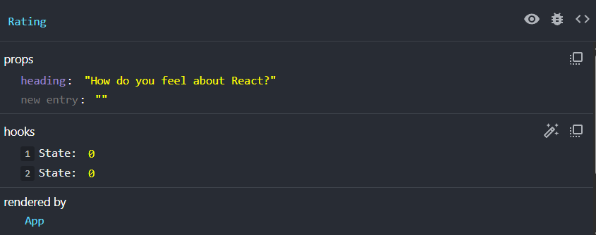

# Props

Props are a way to pass data from a parent component to a child component. They are similar to function arguments in JavaScript. They also work like HTML attributes.

Let's say we want our Rating component to be a bit more customizable.We could pass in props for things like the number of stars, the color of the stars, and the size of the stars. Let's start with something simple and pass in the heading text as a prop.

In your `App.jsx` file, update the `Rating` component to accept a `heading` prop:

```jsx
<Rating heading='How do you feel about React?' />
```

This on it's own does not do anything. In order to receive the prop in the `Rating` component, we need to update the component definition to accept the prop:

```jsx
const Rating =(props)) => {
  //..
};
```

The props object will contain all the props passed to the component. If you look at the dev tools, you will see that the `heading` prop is now available in the `props` object.



## Using Props

To use props, we pass them into the child component function as a parameter. We can then use the props in the component just like any other variable.

```jsx
const Rating = (props) => {
  return (
    <div className='rating-container'>
      <h2>{props.heading}</h2>
      {/* ... */}
    </div>
  );
};
```

Now you will see the heading text displayed in the `Rating` component.

## Destrucuring Props

You can pass in the props object like we have, but a common practice is to destructure the props object in the function signature. This makes it easier to work with the props.

```jsx
const Rating = ({ heading }) => {
  return (
    <div className='rating-container'>
      <h2>{heading}</h2>
      {/* ... */}
    </div>
  );
};
```

## Default Props

You can also set default values for props in case they are not passed in. You can assign default values in the function signature.

```jsx
const Rating = ({ heading = 'Rate Your Experience' }) => {
  return (
    <div className='rating-container'>
      <h2>{heading}</h2>
      {/* ... */}
    </div>
  );
};
```

Now remove the `heading` prop from the `Rating` component:

```jsx
<Rating />
```

You will see the default heading text displayed in the `Rating` component.

## Passing Multiple Props

You can pass multiple props to a component. Just add them to the component tag like you would with HTML attributes. Let's add a `color` prop to the `Rating` component:

```jsx
<Rating color='red' />
```

Remember, the color right now comes from the CSS file, which we don't really have control over. One thing we could do is use the style attribute instead.

Let's update the `Rating` component to use the `color` prop:

```jsx
const Rating = ({ heading = 'Rate Your Experience', color = 'gold' }) => {
  const [rating, setRating] = useState(0);
  const [hover, setHover] = useState(0);

  const feedbackMessages = ['Terrible', 'Poor', 'Fair', 'Good', 'Excellent'];

  return (
    <div className='rating-container'>
      <h2>{heading}</h2>
      <div className='stars'>
        {[1, 2, 3, 4, 5].map((star) => (
          <span
            key={star}
            className='star'
            style={{
              color: star <= (hover || rating) ? color : '#ccc',
            }}
            onClick={() => setRating(star)}
            onMouseEnter={() => setHover(star)}
            onMouseLeave={() => setHover(0)}
          >
            {'\u2605'}
          </span>
        ))}
      </div>
      {rating > 0 && <p className='feedback'>{feedbackMessages[rating - 1]}</p>}
    </div>
  );
};
```

We no longer need the `.active` class in the CSS file. You can remove it if you want.

I want to stick with the gold color, so I won't pass the `color` prop.

```jsx
<Rating />
```

Another thing that we could so is pass in the feedback messages as a prop. This way, the `Rating` component can be used for different types of ratings.

```jsx
<Rating
  feedbackMessages={['Hate it', 'Dislike it', 'Meh', 'Like it', 'Love it']}
/>
```

Update the `Rating` component to use the `feedbackMessages` prop:

```jsx
const Rating = ({
  heading = 'Rate Your Experience',
  color = 'gold',
  feedbackMessages = ['Terrible', 'Poor', 'Fair', 'Good', 'Excellent'],
}) => {
  const [rating, setRating] = useState(0);
  const [hover, setHover] = useState(0);

  return (
    <div className='rating-container'>
      <h2>{heading}</h2>
      <div className='stars'>
        {[1, 2, 3, 4, 5].map((star) => (
          <span
            key={star}
            className='star'
            style={{
              color: star <= (hover || rating) ? color : '#ccc',
            }}
            onClick={() => setRating(star)}
            onMouseEnter={() => setHover(star)}
            onMouseLeave={() => setHover(0)}
          >
            {'\u2605'}
          </span>
        ))}
      </div>
      {rating > 0 && <p className='feedback'>{feedbackMessages[rating - 1]}</p>}
    </div>
  );
};
```

Now your custom messages will be displayed when you rate something.

Again, I want to stick with the default messages, so I won't pass the `feedbackMessages` prop.

```jsx
<Rating />
```

This should give you a good idea of how props work in React. You can pass in any data type as a prop, including functions. We will see how to pass functions as props in soon.

What I would like to do next is break the stars up into their own component.
