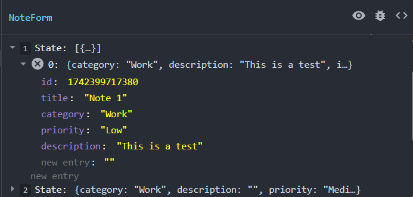

# Form Submission & Global State

Now we want to submit the form. This will be an introduction to global state, which is state that can be shared across multiple components. For example, the notes themselves will be used by a couple different components. When you have global state, there are multiple ways you can store and manage that state. The easiest way, which is fine for small projects like this, is keeping it in the main App component and then pass it into any other components that need it.

If this were a larger app with more state, you may use the context API or something like Redux.

Now since we're keeping our notes in state only, that means that when we refresh the page, the notes will go away. That's because the are not persisting anywhere. In a real world app, you would have some kind of API built with a backend using something like Node.js or PHP that you could submit the notes to and then they would get saved to a database from there. That goes beyond React and frontend development, however later on, we will be learning how to do that with the MERN stack.

Another thing we could do is persist the data to local storage in the browser and we will do that later on.

We'll start by adding a piece of state for the notes. We want this in our `App` component.

Import the `useState` hook.

```js
import { useState } from 'react';
```

Add the following state to the `App` component.

```js
const [notes, setNotes] = useState([]);
```

We set it to an empty array by default.

This is considered app-level state because it will be used by multiple components. We will pass this state and the setter function to the `NoteForm` component as props.

```jsx
<NoteForm notes={notes} setNotes={setNotes} />
```

## Add Props

In the `NoteForm` component, add the following props to the function.

```jsx
const NoteForm = ({ notes, setNotes }) => {};
```

## Handle Submission

Create a function that will handle the form submission.

```js
// Handle form submission
const handleSubmit = (e) => {
  e.preventDefault();
  console.log('Form submitted:', formData);
};
```

With this function, we're preventing the default form submission behavior and logging 'submitted' to the console. We'll add this function to the form element.

```jsx
 <form onSubmit={handleSubmit} className='mb-6'>
```

## Submit Button

Now we need to add a submit button to the form.

```jsx
<button
  type='submit'
  className='w-full bg-purple-500 text-white cursor-pointer py-2 rounded-lg hover:bg-purple-600 transition'
>
  Add Note
</button>
```

If you fill out the form and submit, you should see the form data logged to the console.

## Update Notes State

Now we want to update the notes state with the form data. We'll add the following code to the `handleSubmit` function.

```js
// Handle form submission
const handleSubmit = (e) => {
  e.preventDefault();
  if (!formData.title || !formData.description) return; // Validation
  // Create a new note object
  const newNote = { id: Date.now(), ...formData };
  // Add the new note to the notes array, which gets passed from App.jsx
  setNotes([newNote, ...notes]);
  // Reset form data
  setFormData({
    title: '',
    category: 'Work',
    priority: 'Medium',
    description: '',
  });
};
```

We are checking if the title and description fields are empty. If they are, we return early. If they are not, we create a new note object with the current date as the id and the form data. We then update the notes state with the new note at the top of the array. Finally, we reset the form data. We don't simply do `notes.push(newNote)` because we want to keep the notes state immutable. SO we are using the spread operator to create a new array with the new note at the top. If you wanted the new note at the bottom, you could do `setNotes([...notes, newNote])`.

Check your devtools to make sure that the state on the App component was updated. You should see an object in the notes array with the form data.


