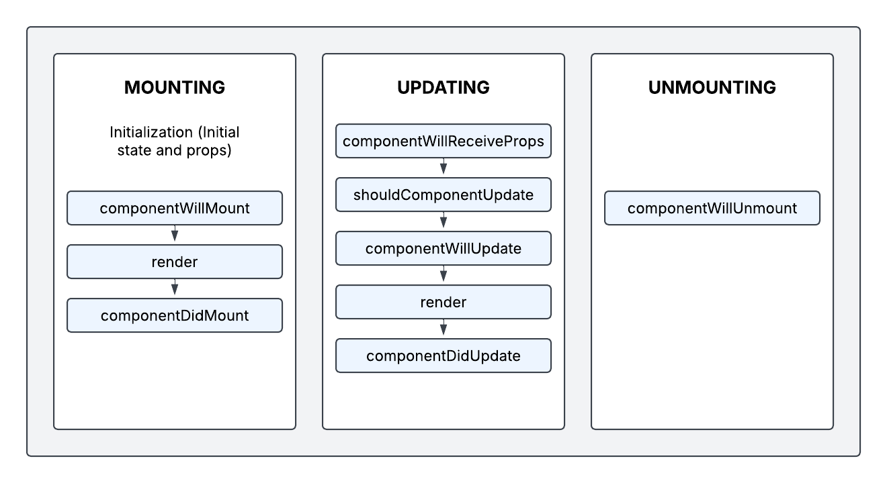

# Lifecycle Methods

As I mentioned, React components used to be written with classes. With classes, we could tap into lifecycle methods to do something when a component was created, updated, or removed. Starting in React 16.8, we can now use functional components to tap into these lifecycle methods. We do this with hooks. This is the standard now, however, I still want to spend one lesson showing you how this works. I think it will give you a better understanding of lifecycle and you may run into class components at some point.

Now don't go writing on Reddit, oh Brad Traversy is using classes in his React course. No, I never suggest using classes now or in the future. The point of this is to give you a better understanding of lifecylce methods and give you a basic introduction into classes in case you run into them.

These are the lifecycle methods that we can tap into with class components on mounting, updating, and unmounting:



Now even when we wrote class components, some of these were not used all that often. The most common ones were `componentDidMount`, `componentDidUpdate`, and `componentWillUnmount`. So that's what I want to focus on.

Again, I will probably say this a few more times, you're not going to be using these. I just think it's important to understand them. For the most part, you'll be using the`useEffect` hook to tap into the lifecycle methods with functional components, which we'll talk about in the next lesson.

# Lifecycle Playground Setup

I want to create asimple React app to play around with lifecycle so you can learn about this topic in a more hands-on way.

Create a new React project with the following command:

```bash
npx create-vite lifecycle-playground
```

Clean up by removing the `App.css` and change the `App.jsx` file to the following:

```jsx
const App = () => {
  return (
    <div className='container'>
      <h2>React Lifecycle Playground</h2>
    </div>
  );
};

export default App;
```

Add the following to your `index.css` file:

```css
/* Reset */
* {
  margin: 0;
  padding: 0;
  box-sizing: border-box;
}

body {
  font-family: Arial, sans-serif;
  background-color: #f4f4f4;
  display: flex;
  justify-content: center;
  align-items: center;
  min-height: 100vh;
}

h2 {
  font-size: 24px;
  color: #333;
  margin-bottom: 20px;
}

/* Container Styling */
.container {
  text-align: center;
  width: 350px;
  margin: 10px;
}

/* Buttons */
button {
  margin-top: 10px;
  padding: 10px 16px;
  border: none;
  border-radius: 5px;
  font-size: 16px;
  cursor: pointer;
  transition: background 0.3s ease-in-out;
}

button:hover {
  opacity: 0.9;
}

.primary-btn {
  background: #007bff;
  color: white;
  margin-bottom: 10px;
}

.secondary-btn {
  background: #28a745;
  color: white;
}

/* Container For Logger */
.logger-container {
  margin-top: 15px;
  background: white;
  padding: 15px;
  border-radius: 8px;
  box-shadow: 0 2px 5px rgba(0, 0, 0, 0.1);
  width: 100%;
  max-width: 350px;
}
```

Now, you can start the development server with the following command:

```bash
npm run dev
```

We have our Lifecylce Playground project. Let's open it up and take a look at the `App.js` file. Right now it just has a heading.

What I want to do is have a separate component that will log out when it's created, updated, and removed. We'll do this with class components first then we'll do it with functional components using hooks.

Let's bring in the `useState` hook into the `App.jsx` file so that we can set up a state to toggle the component on and off.

```jsx
import { useState } from 'react';

function App() {
  const [showLogger, setShowLogger] = useState(false);

  return (
    <div className='container'>
      <h2>React Lifecycle Playground</h2>

      {/* Toggle LifecycleLogger */}
      <button
        className='primary-btn'
        onClick={() => setShowLogger(!showLogger)}
      >
        {showLogger ? 'Unmount Logger' : 'Mount Logger'}
      </button>

      {showLogger && <div>Lifecycle Logger Here</div>}
    </div>
  );
}
export default App;


```

You should be able to toggle the text on and off with the button. You can set the initial state to true or false, it's up to you. Now let's create a new component called `LifecycleLogger` component.

Let's create a new file at `src/components/LifecycleLogger.jsx` and add the following:

```jsx
import { Component } from 'react';

class LifecycleLogger extends Component {
  render() {
    return (
      <div className='logger-container'>
        <h2>Lifecycle Logger (Class Component)</h2>
      </div>
    );
  }
}

export default LifecycleLogger;
```

This is a basic class component. We name it just like we would a function, and we extend the `Component` class from React. Then we have a `render` method that returns some JSX.

This is the same as the following functional component:

```jsx
const LifecycleLogger = () => {
  return (
    <div className='logger-container'>
      <h2>Lifecycle Logger (Functional Component)</h2>
    </div>
  );
};

export default LifecycleLogger;
```

Now bring the `LifecycleLogger` component into the `App.jsx` file.

```jsx
import LifecycleLogger from './components/LifecycleLogger';
```

Add it to the `return` statement.

```jsx
{
  showLogger && <LifecycleLogger />;
}
```

Now you can toggle the component on and off with the button. But we're not doing anything with the lifecycle methods yet.

## Initialization

The constructor method of a class is always run when the class object is initialized. This is not React, this is just object oriented programming with classes. In React, this is also where any props come in. Just like with functions, props come in as an argument.

We also need to call `super(props)` to call the constructor of the parent class. In this case, the parent class is `Component` from React. Then we just log out that the component is being initialized.

```jsx
import { Component } from 'react';

class LifecycleLogger extends Component {
  constructor(props) {
    super(props);
    console.log('⏳ Constructor: Component is being initialized.');
  }

  render() {
    return (
      <div className='logger-container'>
        <h2>Lifecycle Logger (Class Component)</h2>
      </div>
    );
  }
}

export default LifecycleLogger;
```

## Initialization vs Mounting

Initialization and mounting are two different things. The constructor is called when a class component is first created in memory. It is not part of the React lifecycle methods, but it is commonly used to initialize state and bind event handlers. It does NOT mean the component is mounted to the DOM yet.

## Mounting

After initialization, the component is mounted to the DOM. With a class component, we use the `componentDidMount` method to do something when the component is mounted to the DOM.

```jsx
class LifecycleLogger extends Component {
  constructor(props) {
    super(props);
    console.log('⏳ Constructor: Component is being initialized.');
  }

  componentDidMount() {
    console.log('✅ LifecycleLogger Mounted');
  }

  render() {
    return (
      <div className='logger-container'>
        <h2>Lifecycle Logger (Class Component)</h2>
      </div>
    );
  }
}
```

Now when you turn on the component in the UI, you should see both the constructor and `componentDidMount` methods being called in the console.

## State In Class Components

State in class components is much different than with functional components where we use the `useState` hook. With class components, we use the `this.state` object to store state. We also use the `this.setState` method to update state.

Add the following to the constructor method:

```jsx
this.state = {
  count: 0, // Initial count state (same as default value in useState)
};
```

Let's output the count in the render method right under the heading.

```jsx
 render() {
    return (
      <div className='logger-container'>
        <h2>Lifecycle Logger (Class Component)</h2>
         <p>Count: {this.state.count}</p>
      </div>
    );
}
```

We use `this.state.count` to access the message in the state object.

## Updating

When a component is updated, the `componentDidUpdate` method is called. This is where you can do something when the component is updated. For example, you can check if the state or props have changed.

Let's make it so that if the message in the state changes, we log out that the component has been updated.

```jsx
class LifecycleLogger extends Component {
  constructor(props) {
    super(props);
    this.state = {
      count: 0, // Initial count state (same as default value in useState)
    };
    console.log('⏳ Constructor: Component is being initialized.');
  }

  // Component Mounted (Runs once when inserted into the DOM)
  componentDidMount() {
    console.log('✅ LifecycleLogger Mounted');
  }

  // Component Updated (Runs when state changes)
  componentDidUpdate(prevProps, prevState) {
    if (prevState.count !== this.state.count) {
      console.log(`♻️ LifecycleLogger Updated! Count: ${this.state.count}`);
    }
  }

  render() {
    return (
      <div className='logger-container'>
        <h2>Lifecycle Logger (Class Component)</h2>
        <p>{this.state.count}</p>
      </div>
    );
  }
}
```

The `componentDidUpdate` method takes two arguments, `prevProps` and `prevState`. These are the previous props and state. We can compare the previous state to the current state to see if it has changed.

We need a way to update the state. Let's add a button to the `LifecycleLogger` component that will update the message in the state.

Add this right under the paragraph tag in the `render` method:

```jsx
<button className='secondary-btn' onClick={this.incrementCount}>
  Update State
</button>
```

Then add the `incrementCount` method to the class:

```jsx
// Function to update count
incrementCount = () => {
  this.setState((prevState) => ({ count: prevState.count + 1 }));
};
```

If you do not use an arrow function, you need to add the following to the constructor:

```js
 this.incrementCount = this.incrementCount.bind(this);
```

This comes back to what we talked about in the JS refresher about how `this` behaves in regular functions vs arrow functions. That method is not automatically bound to the instance (this). So when you pass it as a callback (e.g., onClick={this.incrementCount}), it's called as a plain function, and `this` is undefined (or the global object in non-strict mode).

💡 Why doesn't this happen in arrow functions?

Arrow functions don't have their own this — they inherit this from their lexical context (i.e., where they are defined). `this` is always the component instance, no matter where the function is called from. My suggestion if you're writing class components is to use arrow functions for your custom methods and event handler functions.

`setState` can take in either an object or a function. We're using a function here because we need to access the previous state to increment the count. Then we're returning an object with the new count.

When you click the button, the message in the state will change and you should see the `componentDidUpdate` method being called in the console.

## Unmounting

When a component is removed from the DOM, the `componentWillUnmount` method is called. This is where you can do something before the component is removed.

Add the following method to the class:

```jsx
  componentWillUnmount() {
    console.log("❌ LifecycleLogger Unmounted");
  }
```

Now when you click the unmount logger button, it will fire off the `componentWillUnmount` method.

This is how we can tap into the lifecycle methods with class components. We can do the same with functional components using hooks. We'll do that in the next lesson.

Here is the final code:

```jsx
import { Component } from 'react';

class LifecycleLogger extends Component {
  constructor(props) {
    super(props);
    this.state = {
      count: 0, // Initialize count state
    };
    console.log('⏳ Constructor: Component is being initialized.');
  }

  // Component Mounted (Runs once when inserted into the DOM)
  componentDidMount() {
    console.log('✅ LifecycleLogger Mounted');
  }

  // Component Updated (Runs when state changes)
  componentDidUpdate(prevProps, prevState) {
    if (prevState.count !== this.state.count) {
      console.log(`♻️ LifecycleLogger Updated! Count: ${this.state.count}`);
    }
  }

  // Component Unmounted (Runs when removed from the DOM)
  componentWillUnmount() {
    console.log('❌ LifecycleLogger Unmounted');
  }

  // Function to update count
  incrementCount = () => {
    this.setState((prevState) => ({ count: prevState.count + 1 }));
  };

  render() {
    return (
      <div className='logger-container'>
        <h2>Lifecycle Logger (Class Component)</h2>
        <p>Count: {this.state.count}</p>
        <button className='secondary-btn' onClick={this.incrementCount}>
          Increment Count
        </button>
      </div>
    );
  }
}

export default LifecycleLogger;
```
