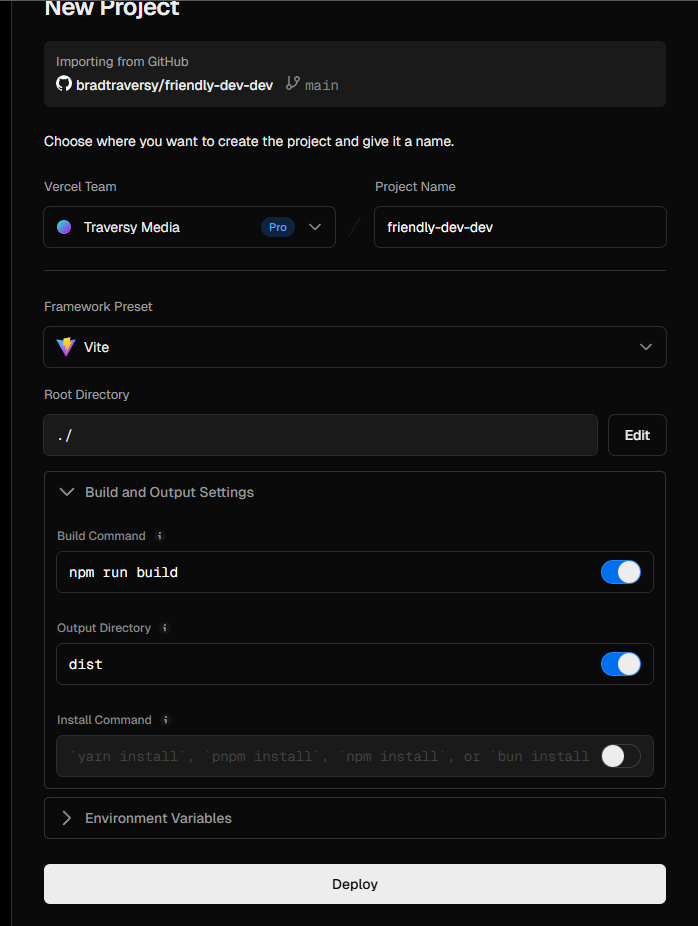

# Deploy To Vercel

When it comes to hosting, you have a ton of options. You can use AWS, Google Cloud, Azure, Heroku, Netlify, and many others. In this tutorial, we will use Vercel, which is a cloud platform for static sites and Serverless Functions that fits perfectly with React frontend apps as well as server-side rendered apps with Next.js. In fact, Vercel is the company behind Next.js.

Vercel is free, fast, and optimized for frameworks like Vite. Plus, it integrates directly with GitHub — so you can deploy with a single push.

## Push To GitHub

You can log into Vercel using your GitHub account. Once you're logged in, you can import your project from GitHub.

So the first thing you need to do is make sure that you have a GitHub repository for your project and make sure that it is completely up to date with the code that you want to deploy.

## Import Project

In your Vervel dashboard, click on the "Add New" button and select "Project".

From there, select your repo. It will probably be the first one in the list. If not, you can search for it.

Click on the "Import" button.

Now you will be taken to a form. From here, you can configure your project settings.

We want to run the build command `npm run build` and the output directory is `dist`. So your form should look like this:

If you had any environment variables, you would also add them here. We don't right now, so we can skip that.

Click on the "Deploy" button.

This will take a couple of minutes. Once it's done, you will see a success message and a link to your project.

You will have a domain like `your-project-name.vercel.app`. You can also add a custom domain if you want.

How easy was that? You can now deploy your projects with a single push to GitHub. Vercel will automatically build and deploy your project for you. This is called Continuous Deployment.

Like I said, if you have a backend, things get a bit more difficult, but for any frontend project, you can deploy it in minutes with Vercel.
