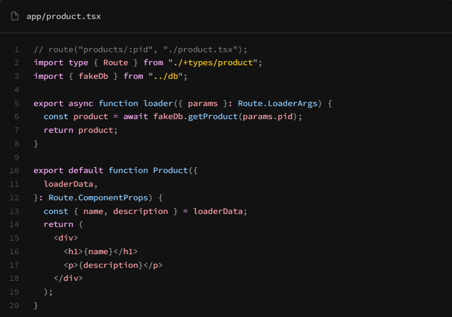

# Loaders Overview

Up until this point, when working with data from an api or a file, we have been using the `useEffect` hook. When working with server-rendered data, we don't want to use `useEffect` because we can now load the data on the server and send it to the client. This is a more efficient way to load data because it reduces the amount of data that needs to be sent over the network and allows us to render the page faster. With `useEffect`, we would have to wait for the data to load before we can render the page, which can lead to a poor user experience.

As you can see from the code in the image, we define the loader above the function and the data that we return from the loader is passed to the component as props. This allows us to use the data in the component without having to wait for it to load.

## Client Loaders

In addition to server loaders, we can also use client loaders. You can use these instead of `useEffect` to load data on the client. So even if you are not using SSR, you can use client loaders. So with React Router v7, there are not many cases where you would need to use `useEffect` to load data. You can use loaders instead. You can also still use client loaders in SSR mode.

You can see with client loaders, they work in a similar way. The data is passed into the component as props. The difference is that the data is loaded on the client instead of the server. This means that the data is loaded after the component is rendered. We can also define a function called `hydrateFallback`, which will be rendered while the client loader is running. So you can show a spinner or a loading message while the data is loading. This is similar to how we would use `useEffect`.

In the next lesson, we will start on the projects section of the website and we will fetch the projects from a file for now using loaders.
