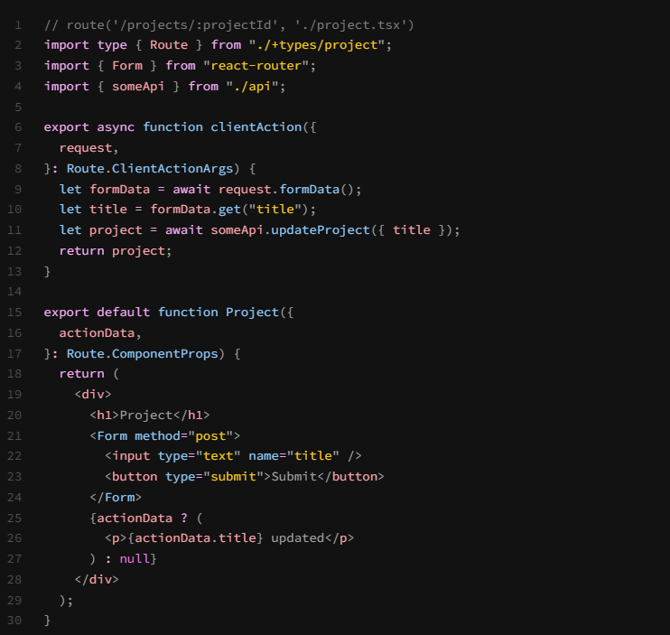
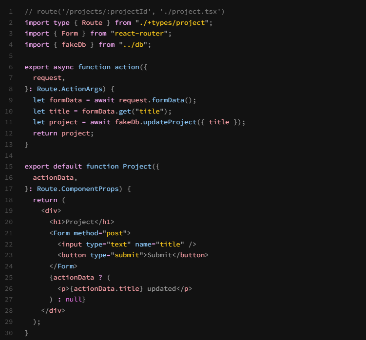

# What Are React Router Actions?

We looked at React Router loaders, which are a way to load data before a route is rendered. They are a great way to fetch data from an API or a database and pass it to your components. But what if you want to handle form submissions or other actions? This is where React Router actions come in. Actions are used for data mutation, which could be creating, updating, or deleting data. They are similar to loaders, but they are used for POST, PUT, DELETE requests instead of GET requests. Actions are also used to handle form submissions and other actions that require a server response.

Now it is important to understand that React Router actions are not the same as server actions that were added with React 19 that you commonly use in Next.js. We'll cover those later. For now, we are going to focus on React Router actions.

## Client Actions vs Server Actions

Like with loaders, we have both client actions and server actions. Client actions are used to handle form submissions and other actions on the client side. They are similar to client-side form handlers, but they are integrated with React Router. Server actions are used to handle form submissions and other actions on the server side. They are similar to server-side form handlers, but they are also integrated with React Router. Client side actions will take priority over server actions. This means that if you have a client action and a server action with the same name, the client action will be used instead of the server action.

Here is an example of a client action:



As you can see, we define the action above the component function. We can then use the `FormData` API to get the form data and use it. You could submit it to an API or do whatever you want with it. This is similar to how you would handle form submissions in a regular React app.

Ther component then takes in the action data as a prop and you have access to it within the component.

You also use a special `Form` component instead of the regular `form` element. This is because the `Form` component is integrated with React Router and will handle the form submission for you. You can pass in the `method` prop to specify the HTTP method to use when submitting the form. This is similar to how you would use the `method` attribute on a regular HTML form.

Here is an example of a server action:



This is similar to how we define a client action, except this runs on the server. So you can do things like directly access your database.

# Using Actions

We don't have an actual backend or any way to actually make our contact form function, but what we can do is just setup an action as if we did and just simulate the process. Later on, we will actually hook up the contact form to a real backend.

Open the `app/routes/contact/index.tsx` file and add the following imports at the top of the file:

```javascript
import type { Route } from './+types/index';
import { Form } from 'react-router';
```

`Form` is the component that we will use to create our form. It is similar to the `form` element in HTML, but it is integrated with React Router. It will handle the form submission and other actions for us.

Add the following action above the function:

```javascript
export async function action({ request }: Route.ActionArgs) {
  const formData = await request.formData();
  const name = formData.get('name') as string;
  const email = formData.get('email') as string;
  const subject = formData.get('subject') as string;
  const message = formData.get('message') as string;
  const data = {
    name,
    email,
    subject,
    message,
  };

  return { message: 'Form submitted successfully!', data };
}
```

This action will handle the form submission. It will get the form data from the request and return a message and the data. We will use this action to simulate the form submission.

## Action Data Prop

Pass in the `actionData` prop to the `ContactPage` component. This prop will contain the data returned from the action. We will use this data to display a success message when the form is submitted.

```javascript
const ContactPage = ({ actionData }: Route.ComponentProps) => {};
```

In order to submit to the action, we need to use the `Form` component instead of the `form` element.

```javascript
<Form method='post' className='space-y-6'></Form>
```

This is something you that you can not do with a regular client-side React app. Using actions allows us to handle form submissions in a more elegant way. We are submitting right to the server and not to a client-side handler. So we can pass the `method` prop to the `Form` component. This will tell React Router to use the POST method when submitting the form.

Now let's output the message in the UI once submitted. Add the following code to the `ContactPage` component below the heading:

```javascript
{
  actionData?.message ? (
    <p className='mb-6 p-4 bg-green-700 text-green-100 text-center rounded-lg border border-green-500 shadow-sm'>
      {actionData.message}
    </p>
  ) : null;
}
```

Now when you submit your form, you will see a success message. This is just a simulation, but it shows you how to use actions in React Router. You can also use actions to handle other actions, such as deleting data or updating data. We will look at how to do that later.

In the next lesson, we will add some form validation.

