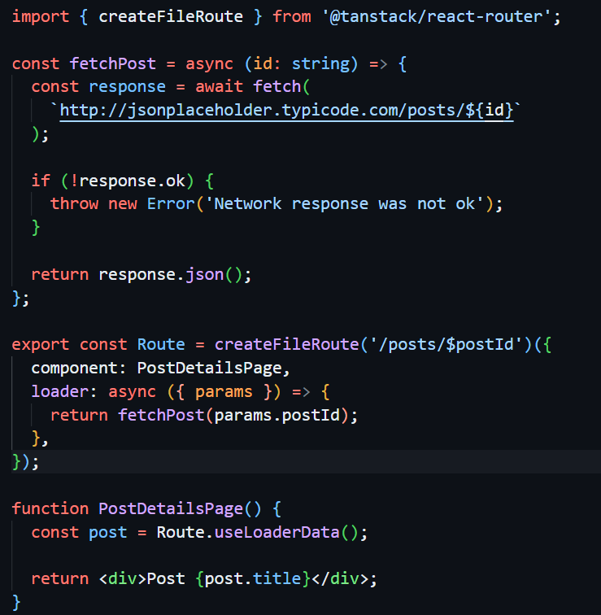

# Intro To TanStack Router?

Right now, if you're not using something like Next.js, Astro or Gatsby, the most popular options for routing is React Router and Tanstack Router. We already went over React Router in both declarative and framework mode. Now I want to show you how to use TanStack Router.

TanStack Router is a powerful and flexible routing library for React applications. It is designed to be simple to use, yet highly customizable, making it suitable for a wide range of applications. It has features like loaders, built-in data fetching, route context, caching and first-class search-param APIs. They don't call it a framework, but for the most part, it is a framework.

TanStack Router is client-based. Even though it includes file-based routing, it still is essentially run on the client. It's not SSR like React Router is by default. One of the reasons that I'm excited for the TanStack Start framework is because it's an SSR framework that uses TanStack Router. But for now, we're dealing with the client. In the end, we'll have a full-stack app because we'll be building a backend with Express later on.

## File-Based vs Code-Based Routing

There are 2 ways to create routes: **file-based** and **code-based**. File-based is definitley the more popular and what is suggested to use. It requires less code for the same functionality and is easier to read. File-based routing is a way to configure your routes using the filesystem. Instead of defining your route structure via code, you can define your routes using a series of files and directories that represent the route hierarchy of your application. Similar to what we did with React Router in the Friendly Dev project. This brings a number of benefits including simplicity, orginization and scalability.

With Code-based routing, we need to define all of our routes within our code. This is similar to what we did with React Router in declarative mode in the Crypto Dash project. We'll be sticking with file-based routing.


## Route Trees

TanStack Router uses a nested route tree to match up the URL with the correct component tree to render. This means that you can have multiple routes that are nested inside each other, and TanStack Router will automatically match the correct route based on the URL.

If we wanted to have a URL of blog/posts/1, we would have a route tree like this:

```
├── blog
│   ├── posts
│   │   ├── $postId
```

And a render component like this:

```tsx
<Blog>
  <Posts>
    <Post postId='123' />
  </Posts>
</Blog>
```

🧭 Route Matching with Parameters

In the route tree, the $postId folder represents a dynamic route segment, similar to [postId] in other frameworks. This means any value in that position (e.g., /blog/posts/123) will be captured as a route param.

Your file structure might look like this:

```
routes/
├── blog/
│   ├── posts/
│   │   ├── $postId/
│   │   │   └── route.tsx
│   │   └── route.tsx
│   └── route.tsx
```

There are a few ways to configure route trees:

- Flat Routes: Where all routes are at the same level. You can use a dot notation to create nested routes. For example, `blog.posts.$postId` would create a nested route for the `blog` route.
- Directory Routes: Where all routes are in a directory. You can use a `$` to create dynamic routes. For example, `blog/posts/$postId` would create a dynamic route for the `blog/posts` route.
- Mixed Routes: Where some routes are flat and some are directory.
- Virtual File Routes: Where you build a route tree programmatically using code that references real files in your project.
- Code-Based Routes: Where you build a route tree programmatically using code that does not reference real files in your project.

## Loaders

TanStack Router also has a powerful data loading system that is similar to loaders with React Router and what was Remix. You can use loaders to load data for your routes. You can pass context down through the loaders as well. This reduces the need to use state management libraries like Redux or Zustand or even the Context API. You can use loaders to load data for your routes and pass it down through the route tree.You can make your fetch requests directly or you can use TanStack Query and utilize the caching and other features that it provides.



## Ways to Use TanStack Router

There are many ways to get setup with the router.

- You can install it on it's own with `npm install @tanstack/react-router`
- You can run the command `npm create tsrouter-app@latest`
- You can run Vite as usual with `npm create vite@latest` and then select the TanStack Router option. This will create a new Vite app with TanStack Router and TanStack Query already setup for you.

I want to show you how to use the Vite option as it requires the least amount of setup and also gives you a ton of other options and libraries to choose from. Vite is really the best way to startup any React project that is not Next.js or Gatsby or something like that.

There is also a full-stack framework called TanStack Start that looks very promising and I was contemplating on using that in this course, however it is still really new and I believe there will be a lot of changes over the next few months so I'm holding off on that for now. But TanStack start includes the router, the query, and the table. You can use it if you want and still try and follow along. There may be some differences though.
