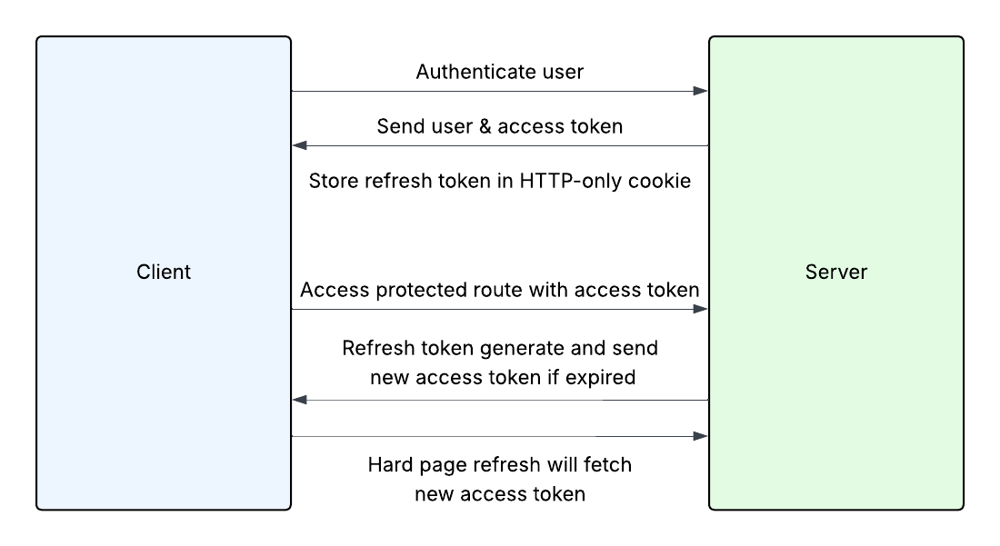

# Section Intro

In this section, we'll be integrating our frontend React app with our API authentication system. I just want to go over exactly how this will work.

First, we'll create our register and login pages. We'll also create a custom layout for those pages.

Then we'll create our Auth Context so that any component can get the token and user if needed. We'll be storing our access token in state.

The way this will work is we fill out the login or register form, we authenticate or create the user then send back a response with the access token and the user. We also set the 30 day refresh token in an HTTP-only cookie.

Then when we make any kind of request to a protected route such as creating, updating or deleting an idea, we send that token with the request. 

Now the token will be lost from the state if you do a hard refresh of the page. This is because we're keeping in memory/state for security. You could make it a little easier and store it in local storage, but I want to give you an optimal setup for security. Since it will be lost on a hard refresh, we'll make it so if we refresh, we'll then use the refresh token to create a new working access token.

I also have the access token to expire after just one minute. You could make this something longer like 15 minutes. But I want to be able to test it, so I want it to be something really short. Also, the shorter, the more secure. The way we'll handle this is to setup an Axios interceptor, which is a function that runs on every request. So we'll set it to check for a 401 unauthorized and if it is a 401, we'll then make the request to use the refresh token and get a new access token.

So that's the plan. If it's confusing, it will make more sense as we move along.

